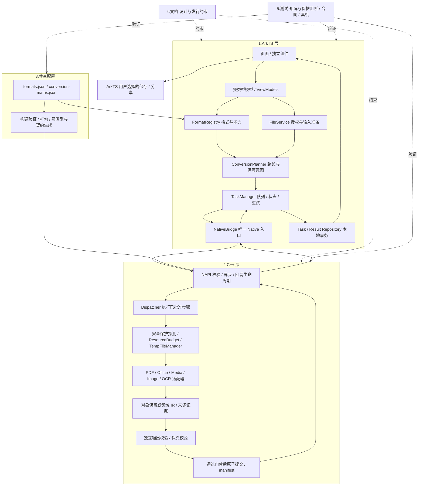
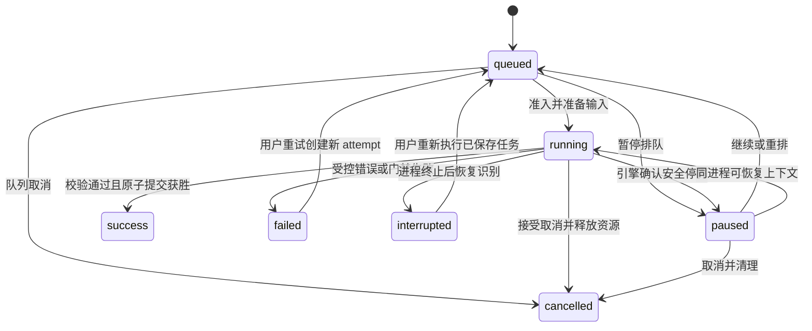
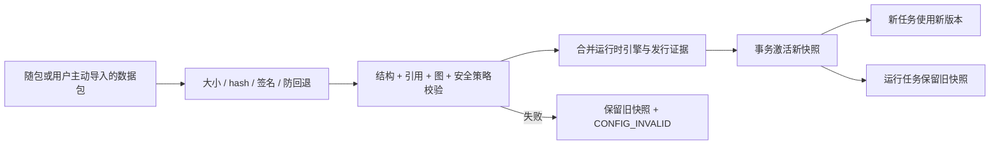
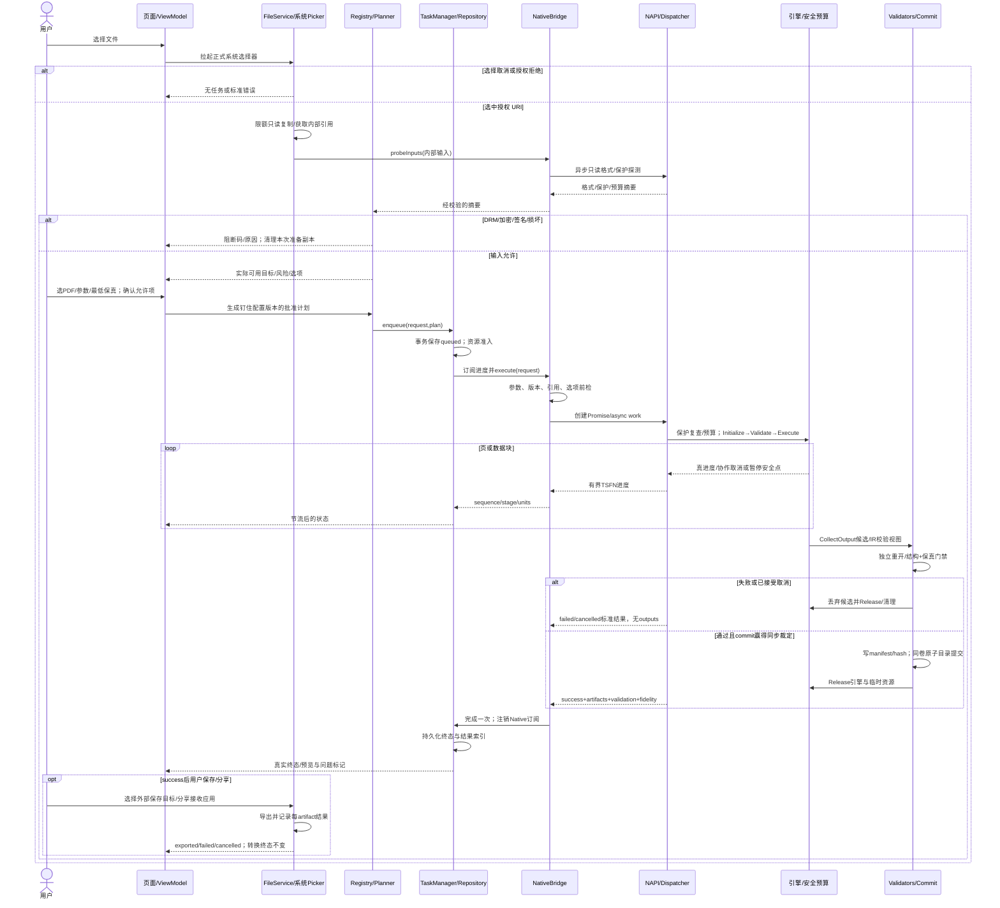
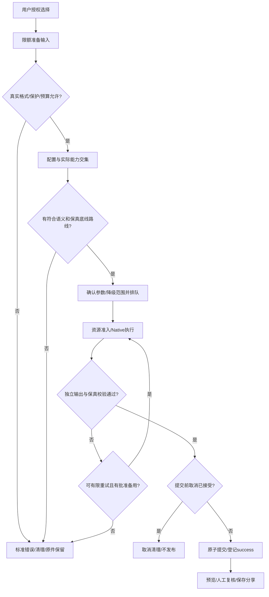
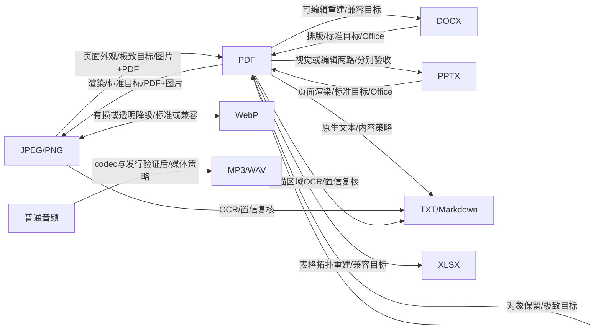

# 鸿蒙离线文档转换软件 V1.0 初步功能开发方案与模块设计说明

版本：设计基线 1.0；编制日期：2026-09-28；交付性质：开发设计，不代表应用已实现或已通过鸿蒙编译、真机验收、上架审核。

## 阅读依据与需求裁定

用户已澄清，本次要求完整研读的文件是 `D:/ChatGPT聊天缓存/2026-09-28/https-github-com-laofeng-mouse-flyingmouse/outputs/harmony-doc-manager-development-prompt.md`，不是上传目录中的 README。本方案已完整读取该文件全部 533 行、15 个章节。另读取现有 README、七份 docs、两个共享配置与关键脚手架源码，仅用于状态核对。

本次用户请求是“初步功能开发设计”。参考文件中“现在从 M0 开始执行编码”等命令属于参考材料中的执行指令，不自动扩大本次授权。本次交付设计、接口契约、配置样例与设计检查脚本，不修改上传工程，不宣称已完成真实转换。

| 依据 | 提取的约束 | 本方案落实位置 |
| --- | --- | --- |
| 核心计划第 1—3 节 | 免费、无账号、无广告、本地处理、首次断网可用；Stage/ArkTS/C++；工具链精确记录 | 产品边界、平台基线、发布检查 |
| 第 4—5 节 | NativeBridge 唯一跨层入口、实际能力交集、授权文件管理、真实结果与导出分离 | 架构图、ArkTS 模块、协议 |
| 第 6 节 | 优先图片→PDF；PDF/Office/音频/OCR 分阶段；不得假定桌面库可移植 | 功能清单、引擎契约、里程碑 |
| 第 7—8 节 | 多输入/多输出、版本化契约、领域 IR、坐标、真实保真证据 | 接口附件、IR 与保真策略 |
| 第 9—10 节 | 受控并发、取消竞态、生命周期恢复、预算、安全提交、脱敏日志 | 任务状态机、资源与异常体系 |
| 第 11—15 节 | 单一配置来源、可重现依赖、质量门、真实验收证据 | 目录、测试、文档与风险 |

冲突按本次用户明确要求裁定，并公开设计取舍：

1. 核心计划允许授权密码解密、识别签名后提示。本次要求 DRM、加密、数字签名阻断测试。因此 **V1.0 发布策略默认阻断这三类文件的转换**，返回 `PERMISSION_DENIED` 加具体 reason。普通授权密码解密保留后续扩展，未经独立验收不开放；不提供签名保持或验签承诺。
2. 本次要求统一 IR，同时核心计划要求避免所有路径强行重建。统一 IR 的 schema、资源与来源规范；直接对象保留路径使用 IR 摘要/校验视图，结构重建路径使用完整 DocumentIR，媒体使用 MediaIR。PDF 拆分/合并不经流式文档重建。
3. “直转优先”是在满足转换语义、最低保真等级和输入子集后比较。禁止为了少一步选择会丢失关键内容的路径，禁止静默由可编辑重建降为整页截图。
4. “支持后台保活”受设备/API/业务资格约束。提供后台能力适配与中断恢复；不能承诺手机、平板上任意本地计算永久驻留。暂停只在引擎可协作停靠时开放。
5. “配置热更新”仅更新数据规格、已安装引擎的开关和路线；不能下载执行代码、安装新 Native 引擎或伪造能力。新增引擎实现、构建注册与安装包更新属于正常发布；不修改核心框架算法。
6. “无原生崩溃”是质量目标。C++ 异常捕获不能拦住任意内存破坏、第三方 SIGSEGV 或系统回收；使用 RAII、模糊测试、预算和适用平台的进程隔离降低风险，明确进程内影响范围。

## 产品、平台与 V1.0 发布边界

产品定位：手机/平板优先的永久免费离线文件管理与转换 Application，无强制登录、广告、云端转换或文件内容遥测。用户主动选择文件；原件只读；结果另存；删除应用历史不删除外部原件。2in1 作为独立验证目标。

实际能力判定：

```text
可展示目标 = 格式与方向配置 ∩ 已安装引擎能力 ∩ ABI加载成功
           ∩ 所需解码器/编码器/离线字体模型 ∩ 输入和参数子集
           ∩ 版本适配 ∩ 对应发布验收证据 ∩ 安全策略允许
```

`planned/experimental/available/unavailable` 为能力状态；`scaffold/implemented/tested/device_verified/release_ready` 为工程证据阶段。二者分开记录。桩引擎返回 `ENGINE_MISSING`，仅用于调度/错误链路单测；不能出现在发布可用能力中。

现状核对：已有格式表 18 个格式、转换矩阵 18 条方向、五类引擎占位、基础页面和两项 Node 配置测试；ArkTS Bridge 是 shim，C++ 把 `offlineOnly` 设为字符串，使用桌面 Node 注册宏；TaskManager 尚无持久化/暂停/有效取消。上述内容不构成真实转换能力。

平台基线：

| 项目 | 设计选择与验收要求 |
| --- | --- |
| 应用形态 | Stage Application，ArkUI 声明式页面，ArkTS 业务，C++ Native 模块；优先官方 Native C++ 模板 |
| 最低兼容 | HarmonyOS NEXT 正式版本；API 12 是现有脚手架基线候选，须在 M0 用正式 SDK、API 引入版本与实际设备锁定，不能自动提高最低版本排除既定用户 |
| 本机已核对 | DevEco Studio 26.0.0.821；SDK/Native 元数据 API 26、26.0.0.105、Release；这只证明文件存在，不证明目标工程构建或 API 12 运行兼容 |
| 编译版本 | 编译可使用本机正式 SDK；compatibleSdk/targetSdk、NDK、Hvigor、ohpm、CMake、Clang、ABI 在 ENVIRONMENT.md 精确锁定；用最低 API 编译检查/兼容分析与真机验证补足 |
| API 风格 | 优先目标 SDK 正式公开 `@kit.*`；封装 File、ArkUI、RDB、生命周期等平台能力；不混用未经核对的新旧 API；新增 API 必须版本/设备检测并有最低版本路径 |
| NAPI | `napi/native_api.h`、目标模板注册和 `libace_napi.z.so`；模块名、so 名、ohpm 声明、index.d.ts 一致 |
| 语言规范 | 无 any/unknown/eval/动态属性注入；JSON 验证后构造显式 DTO；无浏览器 DOM、Node 运行时或 Android API |
| 工程策略 | 初期保持 entry 内清晰分层；不为结构形式拆多个 HAR/HSP；工具链脚本可在开发机使用 Node/Python，应用运行时不能依赖它们 |

耗时 Native 工作采用官方 Node-API 异步机制；当前 SDK 头文件也能核对到 async work、线程安全函数与模块注册声明。[华为：Node-API 异步任务](https://developer.huawei.com/consumer/cn/doc/doccenter-capabilities/use-napi-asynchronous-task)

## V1.0 核心功能清单

P0 为首个可用闭环与发布阻断项；P1 为 V1.0 必做完善项；P2 为计划中的扩展能力。P2 的架构接口/PoC/状态说明要交付，真实功能可在后续版本开放，不能用占位满足 P0/P1。

| 能力 | 优先级 | 交付范围 | 完成证据 |
| --- | --- | --- | --- |
| 授权单个/批量导入、来源类型识别、原件保护 | P0 必做 | Picker→授权 URI→限额沙箱副本；签名/容器检查 | 真机拒权、取消、撤权、损坏输入和原件 hash 验证 |
| 首页、转换配置、任务列表、结果预览 | P0 必做 | 四核心页面；宽窄屏、主题、无障碍、空态与错误态 | 手机/平板实际操作与 UI 测试 |
| JPEG/PNG→PDF，多图排序 | P0 必做 | 尺寸/边距/适应/方向/透明背景；真 PDF | 首次断网生成、独立查看器打开、逐页内容一致 |
| PDF→PNG/JPEG | P1 必做 | 指定页/DPI/质量，逐页多输出 | 页数、页框、旋转、字体与输出重解码 |
| PDF 拆分/合并 | P1 必做 | 显式页选择/输入顺序；保留对象路径 | 预期页集合、尺寸、链接/书签/表单边界验证 |
| JPEG↔PNG、WebP 首批图片方向 | P1 必做 | JPEG/PNG 互转；WebP 方向逐边验证后开放 | EXIF、ICC、透明/背景、有损质量实测；缺 WebP codec 时明确 unavailable |
| 注册、规划、热更新、批量队列 | P0/P1 必做 | 运行时能力交集、快照、资源准入、六状态与阶段 | 配置坏包回滚、并发/取消竞态、无循环降级 |
| 历史、结果保存/分享、缓存清理 | P1 必做 | 事务索引、多输出清单、用户选择保存、文件冲突 | 进程终止恢复、外部保存失败与清理验证 |
| 输出合法性/保真校验、脱敏错误链路 | P0 必做 | 不合格不 success；原件对照与问题标记 | 独立校验、报告证据、错误三端同义 |
| DRM/加密/签名阻断 | P0 必做 | 双重入口阻断、无破解、无输出、清理中间副本 | 矩阵/API 绕过/伪后缀/保护样本测试 |
| 音频 MP3/WAV/FLAC/AAC/M4A/OGG/Opus | P2 扩展 | Media 接口与发行 PoC；原 7 条方向保留 planned | codec/容器逐边能力、许可证、重解码与时长验证 |
| DOCX/PPTX/PDF 方向及 TXT/MD 提取 | P2 扩展 | Office 引擎可行性评估；视觉/编辑/内容语义分离 | 中文字体、样式、分页、表格/图片 reference 样本 |
| OCR、PDF 表格→XLSX | P2 扩展 | 接口、模型交付方案、混合页与表格 IR | 本地模型、首离线、低置信复核、拓扑验证 |
| 暂停/继续、后台适配 | P1 必做边界能力 | 队列暂停普遍支持；运行暂停按引擎能力开放；适用设备后台执行，否则安全停靠/中断恢复 | 不谎称任意引擎可暂停或断点续跑 |
| PDF 授权加解密、GIF/TIFF/HEIF/WMA/视频/AI | P2 后续 | 明确不在 V1.0 发布矩阵；本地扩展点 | 单独范围、发行、平台和安全验收 |

“V1.0 全格式已支持”不作为宣传。首版范围以发布矩阵中的 available 边为准；本表是拟开发目标，尚无真机证据。

## 固定项目核心目录模块划分

以下五行严格保留用户原文与顺序；后续子目录仅是职责落点，不增删或重排核心条目。

1.ArkTS 层：页面、组件、模型、格式注册、转换规划、任务管理、NativeBridge
2.C++ 层：NAPI 入口、转换器接口、错误码、IR 结构、资源限制、保真校验、PDF/Office/Media/Image/OCR 引擎占位
3.共享配置：formats.json、conversion-matrix.json
4.文档：架构、转换矩阵、AI 编程规则、隐私、错误码、保真策略、上架检查清单
5.测试：格式矩阵和 DRM 类格式阻断测试

### 整体架构图与分层数据流



业务数据流：授权 URI → 应用内 fileId/输入引用 → 识别与保护摘要 → 配置/能力快照 → 不可变计划 → Native DTO → 候选输出 → 校验报告 → 已提交 artifact 清单 → 预览/外部导出。文件二进制始终走 fd/内部文件与流，NAPI 不传整份文档或整页图像数组。

分层数据流图（箭头标注传输对象与文件所有权边界）：


依赖方向：页面只依赖 ViewModel；组件只接收值与事件；服务依赖接口、模型和平台封装；NativeBridge 独占 native so import；引擎不依赖 ArkTS、数据库/UI、用户 URI 或商业规则。Native 安全策略是边界约束，Native Dispatcher 只校验并执行批准计划；路线选择、批量优先级、自动重试和用户允许的降级留在 ArkTS。

建议目录映射（保持五大模块，在现有文件旁增补，不要求迁移全部旧文件）：

```text
entry/src/main/ets/
  pages/ components/ models/ viewmodels/
  services/{FormatRegistry,ConversionPlanner,TaskManager,NativeBridge,FileService}.ets
  platform/{FileAccess,BackgroundAdapter,PreviewAdapter}.ets
  repositories/{TaskRepository,ResultRepository}.ets
entry/src/main/cpp/
  napi/ types/libnative_bridge/ core/ ir/ security/ storage/ validators/
  engines/{pdf,office,media,image,ocr}/
shared/format-registry/{formats.json,conversion-matrix.json,schema/}
docs/{ARCHITECTURE,CONVERSION_MATRIX,AI_CODING_RULES,PRIVACY,
      ERROR_CODES,FIDELITY_POLICY,RELEASE_CHECKLIST}.md
tests/{unit,native,contracts,integration,fidelity,performance,fixtures}/
entry/src/{test,ohosTest}/
```

工程辅助的 hvigor/CMake/third_party/tools 不新增业务核心模块。每个依赖固定源码、版本、hash、补丁、ABI、编译参数、许可证和发行义务。

## 1.ArkTS 层：页面、组件、模型、格式注册、转换规划、任务管理、NativeBridge

### 页面

| 页面 | 主要数据与动作 | 状态/边界 |
| --- | --- | --- |
| HomePage | 导入、文件卡片、搜索、名称/时间/类型/大小排序 | 无授权全盘扫描；导入取消回到原态；删除只影响应用副本 |
| ConvertPage | 实际可用目标、质量偏好、转换意图、操作参数、降级说明 | 无 codec/未验收不显示目标；不相关参数不显示；输入校验后才排队 |
| TaskListPage | 排队、阶段、真实进度、暂停/取消/重试 | 是否能暂停由 capability 决定；运行取消显示“正在取消”直至确认 |
| PreviewPage | 主/多输出、校验状态、保真问题页、保存/分享状态 | 懒加载与缓存上限；Office 缺预览能力显示信息/导出；不伪装编辑器 |

历史可作为首页/任务页分区；设置使用统一路由附属页，满足计划而不增加空壳核心页面。Navigation + NavPathStack 管理栈，路由只携带 fileId/taskId/筛选快照，不传 fd、密码、PixelMap 或引擎对象；恢复从 Repository 重建。窄屏单栏、宽屏列表/详情分栏，布局随窗口尺寸调整，包含安全区、字体放大、读屏标签、焦点与大触控区域。[华为：Navigation 分栏](https://developer.huawei.com/consumer/cn/doc/doccenter-capabilities/arkts-navigation-split-mode)

### 组件与模型

基础组件：FilePickerAction、ProgressView、FormatPicker、ConfirmDialog、ErrorPanel。业务组件：ConversionCard、TaskItem、FidelityBadge、ArtifactList。组件 Props 是不可变视图数据，事件经显式回调/事件接口返回 ViewModel；不直接读取全局单例、打开文件、调用 Native 或写任务库。FilePickerAction 只触发选择事件，实际 Picker 由 FileService 执行。

MVVM：ViewModel 合并 TaskRepository 和服务事件，构造局部 UI 状态；模型验证格式、页范围、有限数值、预算、状态转移；视图只读绑定/发出意图。复杂参数用领域类型与白名单，不用自由字典。平台 JSON.parse 返回值不得未经验证断言成模型；生成 decoder 或显式验证器通过后逐字段构造 DTO。

核心模型与三端 Native 类型的完整设计声明见 `entry/src/main/ets/models/NativeProtocol.ets`。DocumentEntity 记录 fileId、显示名、源授权引用、受控副本、真实类型、大小与保护状态；ConversionTask 保存请求摘要、阶段、状态版本、尝试次数、计划/config hash、结果清单；FormatDefinition 定义配置元数据；Native 只接收准备好的内部输入，不接收显示名或任意外部路径。

### 格式注册

接口：`loadBundled()`、`getFormat(id)`、`listImportFormats()`、`queryTargets(input,operation)`、`getCapabilitySnapshot()`、`applyConfigPack(packRef)`、`setUserCapabilityEnabled(routeId,enabled)`。ID/后缀/MIME/默认参数/转换方向来自共享配置；Native 返回实际引擎与 codec 能力，不能直接把 JSON 中 planned 改为 available。

启动从 rawfile 读取构建生成副本；验证 schemaVersion、唯一 ID、必填字段、枚举、数值范围、引用完整性、阻断策略和图复杂度；校验成功一次性发布不可变快照并内存缓存。故障回退最近有效配置/随包基线，显示可追溯错误；禁止空表被当作支持全部。

热更新为本地导入的签名数据包/已交付配置激活：大小限制→hash/签名/版本/防回退→完整 schema/语义验证→能力交集重算→事务替换→通知页面。签名验证用成熟正式密码能力；不自行发明密码算法。已有任务钉住旧快照，新任务用新快照；强制安全禁用另有撤销策略，在 Native 执行前再次检查。更新不能扩大只读目录或取消 DRM 阻断规则。

### 转换规划

输入为实际格式与保护摘要、操作、目标、用户选项、意图、保真底线、资源与快照。输出不可变 ConversionPlan，包含 routeId、依赖引擎/步骤、估算预算、风险、fallbackRouteIds 和配置 hash。

规划算法：先拒绝保护/未知格式；以 operation + from + to 匹配合法路线；过滤 codec、版本、输入子集、意图与最低等级；同等级优先 direct，再按用户允许的损失、优先级、步骤数、实测成本排序。relay 只能由显式配置组成且中间类型一致，最多 3 步、去环；不对任意两种格式自动拼图。多文件：独立转换拆子任务；images_to_pdf/pdf_merge 保持多输入一个原子任务；批次父记录聚合成功/失败，不把批次部分成功标成全部成功。

降级：同意图、同最低等级的备用引擎可自动切换；需要牺牲内容/编辑性/版式时先展示具体差异并取得用户选择，不接受就失败。释放上一尝试全部资源后才重试；每任务默认最多 2 次尝试（含首次），禁止主备路线来回循环。权限/保护/密码/损坏/非法参数不自动重试；临时 I/O 或尚未执行的资源压力可有限等待重试。

### 任务管理

六个用户核心状态保持为 queued/running/paused/cancelled/success/failed。补充 interrupted 表示系统/进程中断；preparing/executing/validating/committing 为 running 内部阶段；pausing/cancelling 是控制请求标记，不伪造已生效状态。



TaskRepository 用 RDB 事务保存 taskId、batchId、state、stage、stateVersion、attempt、requestSummary、configVersion/hash、时间、manifestRef、错误码；不会保存密码、正文或远程遥测。状态更新 CAS/版本检查，终态单次确定。数据库表包括 tasks、task_attempts、artifacts、export_records；外部导出状态 pending/exporting/exported/failed/cancelled 单独管理。

默认 1 个重型任务；线程预算由 Native ResourceBudget 二次准入；只有完成线程安全/资源实测的轻任务可增加并发。不并叠 ArkTS Worker 池、TaskPool 与无限 Native 线程池。防饥饿采用用户优先级加排队时间老化；无资源时等待，不能偷偷降低已承诺保真度。

暂停：排队暂停立即生效；运行暂停由引擎声明 supportsPause，并在页/阶段等安全点确认。无暂停能力时禁用按钮，提供取消与重新执行。断点预留 checkpoint schema、输入 hash、引擎/config 版本、已完成阶段/页、校验和；恢复只复用已验证的阶段产物，不序列化任意引擎内存。

进程恢复：扫描合法 manifest 并核对内部结果；运行/验证/提交未完成任务记 interrupted，清理半成品；已原子提交但数据库未登记的结果可经完整门禁与 manifest 复核补索引，不能重新假定成功。后台策略由 BackgroundAdapter 根据设备、API、场景、授权选择；不把本地转换假扮网络传输或播放。旧版 TASK_KEEPING 仅对2in1的约束、新版媒体特殊场景都须按实际资格核对，不能套用于所有 PDF/Office 任务。[华为：后台任务 API](https://developer.huawei.com/consumer/cn/doc/harmonyos-references-V14/js-apis-resourceschedule-backgroundtaskmanager-V14)、[华为：视频后台导出场景](https://developer.huawei.com/consumer/cn/doc/best-practices/bpta-video-background-export)

### NativeBridge

NativeBridge 独占 so 模块；包装强类型调用、所有参数前检、领域错误归一化、Promise 完成、进度订阅、引用释放及 env 销毁。Page 离开只注销页面订阅和预览引用，仍运行任务的上下文由 TaskManager 持有；明确取消/服务关闭才发 Native cancel。不能把页面销毁当作静默杀死整个队列。

| 接口 | 契约与线程 | 主要异常 |
| --- | --- | --- |
| `initializeSession(init)` | 仅受信任平台服务传入当前应用真实私有根目录；Native规范化并绑定允许根与config hash，返回sessionId | 非应用根、版本错误、配置不一致 |
| `registerWorkspace(grant)` | FileService创建随机任务目录后，Native验证相对目录、所有权/边界并返回workspaceRef；只用于本task/attempt | 路径逃逸、重复或无效session |
| `getCapabilities(request)` | 异步，protocol/config 版本、ABI、引擎、codec、输入子集、暂停/检查点、offlineOnly 布尔值 | 协议/ABI/引擎加载错误 |
| `probeInputs(request)` | 异步、只读有限探测；真实格式/页数/保护/预算摘要，完整保护检查仍在执行前完成 | 损坏、权限、超预算；摘要不得泄漏正文 |
| `execute(request)` | 异步执行批准计划；resolve 标准 success/failed/cancelled 终态结果；未通过门禁 outputs 为空 | 业务失败放 result.error；绑定/调用环境错误归一化为 BridgeError |
| `subscribeProgress(taskId,listener)` | env 所属线程建订阅，返回 token；有界 TSFN 分发 | 无效任务/销毁环境 |
| `unsubscribeProgress(token)` | 幂等注销，清理引用；页面销毁调用 | token 不存在返回 false |
| `cancel(taskId,attemptId)` | 异步 ack accepted/too_late/not_found；accepted 后等待终态 cancelled | 不把 ack 当成已清理 |
| `pause/resume(taskId,attemptId)` | 异步能力门控，确认安全点后更新状态 | 不支持返回 UNSUPPORTED_FEATURE |
| `releaseTask(taskId,attemptId)` | 异步幂等，终态清理 handles/订阅；活动任务拒绝，不能绕过 cancel | TASK_BUSY |
| `releaseArtifact(ref)` | 释放预览/读 handle；不删除持久结果 | 已释放幂等 |
| `shutdown()` | 关闭准入→协作取消→取消订阅→清理 async/ref；env 析构最后兜底 | 引擎不协作记录隔离风险 |

密码接口不进入 V1.0 发布 API；未来使用独立临时密钥句柄，避免不可擦除 ArkTS 字符串在模型/历史中复制。

## 2.C++ 层：NAPI 入口、转换器接口、错误码、IR 结构、资源限制、保真校验、PDF/Office/Media/Image/OCR 引擎占位

### NAPI 入口与执行模型

输入解析在 env 所属线程完成：检查参数个数、类型、有限值、枚举、大小、版本和工作区凭证；转换为纯 C++ DTO 后排入 async work。execute 回调不访问 napi_value/原线程 env；只操作 C++ 对象、fd 和有限缓冲。complete 回到创建 env 的线程映射结果、resolve 一次、删除 work/ref。NAPI 每次调用检查 napi_status；pending exception 与常规错误区别处理；所有导出边界和工作函数捕获 std::bad_alloc/std::exception/未知 C++ 异常。

进度线程安全函数使用有限队列、非阻塞投递、覆盖合并旧进度；建议最多 5 次/秒/任务，阶段变化即时投递；终态通过 Promise/任务存储可靠送达，不能因进度队列满丢掉完成结果。sequence 按 attempt 单调递增，订阅端丢弃旧 attempt/重复序列；未知总量用不定进度。

所有 NativeTaskContext 使用 shared_ptr 维持 async/work/control 的共同生命周期；转换器/临时文件/fd 使用 unique_ptr/RAII；napi_ref 和 TSFN 按所属 env 清理，不在任意线程析构时随意调用 NAPI。禁止 detach 后不受管控的工作线程。模块卸载/Ability 销毁发生时，先停止回调入口、请求取消，再释放 task 服务持有的引用。

首版可移植 core 使用 C++17，NAPI glue 独立目标。构建从目标 DevEco 模板生成，核对 module 注册、CMake 链接和 `.d.ts` 包声明；当前脚手架 `NAPI_MODULE(NODE_GYP_MODULE_NAME,...)` 不作为鸿蒙可用证据。[华为：Native 子线程与 UI 主线程交互](https://developer.huawei.com/consumer/cn/doc/doccenter-capabilities/native_subthread-to-uimain)

### 转换器接口与插件注册

完整 C++17 契约见 `entry/src/main/cpp/core/converter.h`，生命周期如下：

```cpp
class IConverter {
 public:
  virtual ~IConverter() = default;
  virtual ConverterCapabilities Describe() const = 0;
  virtual Status Initialize(const EngineInitContext&) = 0;
  virtual Status Validate(const ConvertRequest&, const TaskContext&) const = 0;
  virtual Status Execute(const ConvertRequest&, TaskContext&) = 0;
  virtual Result<CandidateOutput> CollectOutput(TaskContext&) = 0;
  virtual void Release() noexcept = 0;
};
```

五段式严格为 初始化→参数校验→执行转换→候选结果输出→资源释放。Describe 是元数据查询；独立 Validator/CommitCoordinator 才能判定全任务成功。CollectOutput 仅返回候选文件和校验视图，不创建 success、不注册历史、不导出用户目录。Release 幂等、无异常；部分初始化失败也必须释放；生命周期 guard 保证任意 return/throw 都执行清理。EngineAdapter 内部错误统一映射 Status，C ABI 不跨边界抛异常。

插件使用随包编译的 factory registry：每个引擎实现接口和声明 manifest，构建脚本从 manifests 生成注册项；核心 Dispatcher 不添加 if(format) 分支。每个步骤的engineIds声明依赖集合，executorEngineId指定负责该步骤的适配器；生成ApprovedPlan后仍保留这些字段，Native按config hash核对而不是隐式猜测。已有 engine 的新格式方向只改配置和适配器子集；新 engine 新增实现、manifest 与构建目标，正常发版。严禁运行时加载用户配置中的任意 so 路径。第三方只访问任务能力句柄与预算分配器；协议主版本不兼容拒绝加载，minor 新字段必须可降级理解。

### 错误码与全链路异常

稳定机器码为跨语言真值；Native 枚举有显式整数，映射固定字符串，文案用 messageKey 在 ArkTS 本地化；不把第三方原始错误/敏感堆栈直接展示。现有九个字符串错误码全部保留；扩展表见文档模块。错误对象含 code、reason、module、stage、retryable、traceId、脱敏 detailKey，不包含正文、路径、密码。

输入/授权/探测/规划/准入/引擎/校验/提交/导出每层都捕获并映射。文件部分损坏只有引擎支持容错且用户选择内容恢复、关键安全检查通过时才允许候选；失败内容不得以成功文件悄悄发布。原生 SIGSEGV/系统 OOM 由诊断与启动恢复处理，不能宣传为 catch 可捕获。

### IR 结构与序列化

DocumentIR 顶层 schemaVersion、documentId、sourceFormats、flow/fixed、styles、resources、provenance、unsupportedFeatures；语义、样式和资源完整分离并相互引用。资源引用仅是 taskResourceId/hash/type/尺寸，不包含外部绝对路径；实际内容按页/块分片存储，不用巨大 JSON/Base64 传到 ArkTS。

| IR | 内容与约束 |
| --- | --- |
| FlowDocumentIR | sections、段落/runs、标题/列表、表格、锚定对象、分节/分栏、页眉页脚、分页约束；明确自动分页与源分页不同 |
| FixedDocumentIR | pageBox/CropBox、rotation、文本 glyph/bbox、图片/矢量、z-order、transform、阅读顺序；保持页面几何 |
| StyleIR | 原属性与 resolved 属性、主题/继承引用、显式关闭/清空/缺省、字体候选、字重、段落/字符样式；循环引用受限 |
| TableIR | rows/columns/cells、rowSpan/colSpan、边框、填充、宽高、对齐、表头与跨页规则；跨度合法、无重叠 |
| ResourceIR | 图片/字体/参考渲染/附件的局部 ID、hash、授权/嵌入限制；外链默认不解析 |
| ProvenanceIR | 来源页/元素、解析/推断方法、置信度原值/校准版本、降级理由、未知特性与证据引用 |
| MediaIR / ImageIR | 媒体容器/流/codec/timebase/duration/采样；图像像素/方向/色彩/透明/帧信息；不套文档排版指标 |

几何统一 pt、左上原点、x 向右/y 向下；保留原坐标与变换。1in=72pt，1twip=0.05pt，1pt=12700EMU，pixel=pt×DPI/72。PDF 坐标必须综合页框、旋转与仿射变换；屏幕 vp 不参与排版。浮点值要求 finite，精度/舍入按路径定义。

Office 路线：成熟本地排版优先；子集必须正确解析 OOXML 包关系、Content Types、主题、basedOn 属性继承、直接格式、编号、节、母版/布局、组合变换。HarfBuzz/FreeType 等仅是候选的成形/字度量基础，不能当作完整 Word 排版引擎；实际第三方组合仍需目标 ABI/许可证 PoC。中文禁则、kerning、字体 fallback、keep/widow-orphan、表格跨页与浮动环绕要有明确实现边界。公式/SmartArt/嵌入对象/修订等不能保留时记录 unsupported，关键损失按策略拒绝。

IR 序列化采用版本化、结构化、分片 JSON 清单加二进制资源；写出 hash/长度/枚举/坐标范围、引用完整性与最大嵌套限制，读入先验证再构造。round-trip 测试验证结构/样式/资源/来源，不承诺格式无损。任务中断只保留有版本/hash 的已验证阶段检查点；终态清理临时 IR，持久保真报告可能敏感，按结果文件同级保护。

### 资源限制与文件提交

下表是 **待真机标定的保守初始预算**，不是已测性能或所有设备保证。由共享资源 profile 提供，Native 取平台/安全上限与请求较小值，不能由用户任意增大硬上限。

| 预算 | 初始 profile | 执行策略 |
| --- | --- | --- |
| 单输入/批次累计 | 100MiB / 300MiB | 选择后估算、复制过程中计量，达到上限停止 |
| PDF 页数/批次图数 | 300 / 100 | 探测受控，分页处理；过限提示分批 |
| 单页像素 | 1600万 | 检查宽×高×通道 overflow；解码前与实际 decode 再检查 |
| 每任务 Native 管理预算 | 192MiB；软线 153MiB | 估算 admit；运行计量；软线缩缓存/排队；硬线可协作终止 |
| 应用总内存初始目标 | 峰值 PSS ≤384MiB（最低目标设备） | 包含 ArkTS/Native/codec/缓存；外部引擎分配不能只靠自有 allocator 统计，配系统采样实测 |
| 引擎线程/并发 | 每任务最多2线程、重型并发1 | 引擎内部线程也算入；库无法控制时拒绝合入发布配置 |
| 临时磁盘 | 单任务512MiB；全局1GiB；保留至少128MiB空闲 | 写入持续复核；系统 ENOSPC 映射 STORAGE_FULL，不只启动检查 |
| ZIP/OOXML | 解压累计256MiB、条目10000、嵌套4、压缩比100 | 对压缩炸弹、Zip Slip、symlink、外部实体/关系拒绝；比值是风险门，不代替累计限额 |
| 单 attempt 耗时 | 180s 初值，路径可设更小 | 超时请求取消；只能在引擎安全点生效，不靠 timer 杀线程 |
| 预览缓存/日志 | 图缓存32MiB、日志8MiB轮转 | LRU/显式释放；页面退出不保留 PixelMap |

支持流式 IO、逐页渲染、小缓冲解码/编码、有界缓存。RAII 包装 fd、引擎对象、内存、临时目录；工具 Sanitizer 在支持的 host/target 环境使用，host 检查不替代设备。降 DPI/丢元数据/位图化均可能改变保真承诺，需符合预先批准策略；压力优先缩缓存、降低并发、排队，其次用户选择降级，最后安全失败。

文件授权在 ArkTS 使用 Picker/fileIo 正式 API；URI 不截字符串当路径；Native 只收应用内生成并校验的 workspace 相对路径/目录句柄与输入 fd。PathGuard 验证真实目录边界和访问所有权，拒绝 traversal、绝对路径、symlink 与 TOCTOU；Native 内部 dup fd 后独占拥有，调用侧 fd 持有至握手完成再关闭。

结果事务：任务 `staging/task-attempt/` → 写候选 → close/flush → 输出重开校验 → 按保真 policy 判定 → manifest+hash 落盘 → 同一文件系统 rename 整个结果目录 → Repository 索引。外部 Picker 保存可能不原子：逐文件记录成功/失败，保留应用内合格结果，清理自身可控的半成品；无外部删除授权时提示用户检查，不能保证强删其他提供者文件。

取消和提交共享 mutex/单一 commit state：提交获胜则返回 too_late 并维持 success；提交前接受取消则不得发布 success，候选清理完毕才 cancelled。多个输出一次目录提交，禁止发布半套转换结果。启动清理仅遍历应用任务目录，跳过有活跃租约的任务；损坏 manifest、断电、cleanup 失败记录可追踪待清理，后台/下次启动继续安全清理。

### 保真校验

OutputValidator 先验证输出真格式、独立重开/解析、页/图片/音频流完整性、资源引用、OOXML 包结构与请求一致；不以“非空”判成功。FidelityValidator 从源探测/IR 与独立输出视图测量语义、样式和视觉；直接转换使用对象/页面/图片视图，不为验证破坏原对象。

报告字段：intent、requested/achievedTier、source/output 页数、指标状态/分母/算法版本、字体替换、文本缺失/额外/顺序、图片区域匹配、表格拓扑、版式差异、可编辑性、未知/降级项、需要人工复核、engine/validator 版本、evidenceRefs。measured/estimated/unavailable/not_applicable 四状态，不可用不填 0 或100%。

通过策略：硬结构错误、关键内容丢失或最低等级未达到→failed/OUTPUT_VALIDATION_FAILED，不注册候选；经用户预先允许的轻微降级→success+warnings+requiresManualReview；高风险 unavailable 指标不能按通过处理。每条 route 独立 profile，文档提取不考分页、图片不考文字、音频不考表格。

### PDF/Office/Media/Image/OCR 引擎占位

| 引擎 | 输入/输出契约 | 候选依赖与 PoC | 能力边界与桩行为 |
| --- | --- | --- | --- |
| PDF | PDF 输入引用+页集/渲染参数；候选 PDF、逐页图或文本+FixedIR摘要 | PDFium 等渲染/读写候选，拆分/合并/写出能力独立核验，不能假设单库包办 | 受保护先阻断；页框/旋转/字体；不承诺 PDF/A、签名保持或所有交互表单 |
| Office | DOCX/PPTX 或 Fixed/Flow IR；PDF/OOXML/文本候选与特性报告 | 成熟离线可发行引擎优先；结构库+成形+有边界排版只作子集 PoC | 不包含 DOC/PPT；宏不执行；关键复杂元素拒绝；整页视觉与编辑重建分路 |
| Media | 内部音频输入+codec/container/options；音频候选+MediaIR | 目标系统 Native codec；不足时 FFmpeg 库裁剪构建，审计全部编译选项 | MP3读写分别探测；M4A/OGG 容器与codec分开；流式/flush；不 DRM、不 TTS/ASR |
| Image | 编码图像输入+方向/ICC/alpha/输出参数；编码图像或图片PDF页面数据 | 正式 Image Native API/可交叉编译库；验证编码端能力 | 透明→JPEG 明示底色；动画多帧不隐瞒；不执行 SVG 脚本/外链 |
| OCR | 授权页图/扫描区域+语言/模型ID；text/bbox/原置信度/表格提示+Provenance | 本地模型/成熟候选 ABI PoC，随包/正式安装交付 | 先简中/英文；混合页去重；不把置信度当准确率；缺模型 unavailable |

各桩实现返回同一受控 `ENGINE_MISSING`、Describe.available=false、真实缺失原因；不得写空白/假输出。模拟成功引擎只在 test build 注册，release gate 自动拒绝。系统编解码能力采用 C++ 可调用的正式 Native API/适配器；ArkTS 可持有平台预览/授权对象，但不承担转换核心。

候选依赖专项约束：PDFium 官方当前主分支使用 GN/Ninja，默认构建包含 JavaScript/XFA 且采用 C++20；本产品若选用，应固定commit与参数，关闭pdf_enable_v8/pdf_enable_xfa等不需要的活动内容能力，按目标Clang验证。核心契约维持C++17，后端单独构建其所需标准，通过公开C API/适配器隔离；官方通用平台构建说明不等于HarmonyOS发行构建已被证明。[PDFium官方构建说明](https://pdfium.googlesource.com/pdfium/+/refs/heads/main/README.md)

FFmpeg仅为候选，发行许可证取决于实际启用组件与附加库；项目策略排除enable-gpl/enable-nonfree及不可再分发组合，审查LGPL对应源码、链接和替换/再链接等义务后才能使用。并不因为“免费应用”免除发行义务。[FFmpeg官方发行说明](https://ffmpeg.org/legal.html)

## 3.共享配置：formats.json、conversion-matrix.json

附带 `shared/format-registry/` 是拟议 schema v1 配置样例，18个格式、43条操作/方向路线全部为planned，不替换上传配置或声称引擎可用。规范 ID 用 jpeg，后缀 jpg/jpeg 为别名；迁移旧 jpg ID 在一次性配置迁移表中处理，避免硬编码双重格式。18 个现有格式全部保留；5 个受阻格式仅在 blockedFormats，不进入可转换格式表。43条路线包括原18条方向及本方案增补的同格式操作、图像、内容、OCR、混合输入和批准备用路线。

| 文件 | 关键字段 | 语义校验 |
| --- | --- | --- |
| formats.json | schemaVersion/configVersion、formats[id/displayName/extensions/mimeTypes/import-export operations/category/defaultOptions]、blockedFormats、securityPolicy、resourceProfiles | ID/后缀唯一规范化、MIME非空、默认参数符合操作域；安全策略不可由低信任更新降低；未知字段按 schema 策略处理 |
| conversion-matrix.json | routes[id/from[]/to/operation/pathMode/intent/fidelityTier/engines/priority/status/steps/fallbackRouteIds/inputConstraints/optionsProfile/validationProfile] | source支持import、target支持export；多输入/cardinality；steps类型可衔接、同语义、最大3步；fallback无环、不得跨意图/降低底线静默执行 |

pathMode=direct/relay（路线形态）；intent=layout_preserved/structured_rebuild/content_only（转换语义）；qualityMode=fast/balanced/high_fidelity（速度/资源偏好）；fidelityTier=extreme/standard/compatible（质量承诺）。四者不能混为旧 matrix 的单个 mode 字段。

优先级数字越小越优先；不是保真分数。静态 `status=planned` 表示研发状态；只有签名版本的发行证据与运行时 probe 都满足才可展示 available。fallbackRouteIds 顺序是批准的候选路线，失败可重试性和用户同意仍由 TaskManager 决定。

配置更新流程：



配置仅能声明现有协议可表达的参数和操作。未知操作/未知 IR schema 不能通过热更新新增业务算法；未来真正新语义需要协议演进与兼容发布。“不用发版调整矩阵”不等于“不用发版安装转换器”。

## 单文件完整转换时序与流程

以下以单张 PNG→PDF 为例，合并/多图输入复用同一契约；拆分/逐页输出使用 outputs[]。





## 4.文档：架构、转换矩阵、AI 编程规则、隐私、错误码、保真策略、上架检查清单

本节给出七项交付的可直接执行内容。实施时拆入既定 docs 文件并维护，架构/矩阵图由配置生成或校对；ENVIRONMENT、PROTOCOL、RESOURCE_POLICY、THIRD_PARTY_NOTICES、IMPLEMENTATION_STATUS、OFFICE_ENGINE_FEASIBILITY 是上述文档的工程附件，不新增核心模块。

### 架构文档

ARCHITECTURE.md 应包含本方案的架构图、分层数据流、单文件时序、依赖方向、六状态/内部阶段、取消与提交同步点、恢复事务、配置快照、资源所有权。PROTOCOL.md 固定三端字段类型/枚举/缺省/错误语义；每次接口变化同时更新 `.ets/.d.ts/C++/配置schema/合同测试`。

关键决策记录 ADR：统一 NativeBridge；完整文档重建可选 IR；Native 候选输出不能自行宣告成功；ArkTS 负责路线/重试；同卷目录提交；签名数据热更新；免费离线依赖的可发行性门禁；后台功能按平台资格开放。每条 ADR 写问题、选择、后果、回退条件与日期。

### 转换矩阵文档：用户版与开发版

用户版仅展示发布已验收路线，用“保留页面外观/可编辑重建/提取内容”“转换会改变什么”“是否需要人工复核”说明，不展示引擎实现细节。研发版保留 planned 路线与每 routeId 的引擎版本、ABI、输入子集、codec、参数、限制、保真 profile、失败码、测试报告和状态。

以下是目标路线图，不是当前可用功能图；灰色规划能力由实际验收逐条开放：



| 操作族 | 输入→输出 | 依赖 | 目标等级 | 已知限制/开放阶段 |
| --- | --- | --- | --- | --- |
| images_to_pdf | JPEG/PNG→PDF；WebP 后接 | image+pdf writer | extreme（子集） | 实际保留所有输入与顺序；不得重编码却声称无损；M1 |
| render | PDF→PNG/JPEG | pdf+image encoder | standard | DPI、裁切、字体、alpha；静态外观、不可编辑；M2 |
| split/merge | PDF→PDF | pdf object copy | extreme（子集） | 明确书签、链接、表单重映射；含签名/加密阻断；M2 |
| image_convert | JPEG/PNG/WebP 逐边 | image codecs | standard/compatible | JPEG有损、透明背景、ICC/元数据处理；M2 |
| office_render | DOCX/PPTX→PDF | office layout+pdf | standard（目标） | 字体与OOXML子集；不可发行则 unavailable；M3 |
| rebuild | PDF→DOCX/PPTX | pdf+office writer，必要时OCR | compatible | 语义推断/可编辑性受限；全页图模式独立 route；M3 |
| content | PDF/DOCX/PPTX→TXT/MD，DOCX↔PPTX | extraction+writer | compatible（内容语义） | 不承诺分页、完整样式与所有关系；M3 |
| table | PDF→XLSX | pdf/table+OOXML writer | compatible | 合并单元格/数值类型/跨页需证据；M4 |
| ocr | 图片/扫描PDF→TXT/DOCX | image+ocr+writer | compatible | 模型首次离线、低置信人工复核；M4 |
| audio | 原矩阵普通音频→MP3/WAV | media codec+container | standard/compatible | 原7条音频边保留；M2 PoC后按边开放，列P2扩展 |

后缀不是操作：PDF→PDF 中 split/merge/encrypt/decrypt 必须不同 operation。V1.0 无 encrypt/decrypt available 路线。发布文案不能把 DOCX 支持写成 DOC、PPTX 写成 PPT，不能宣称音频任意互转或整页截图可编辑。

### AI 编程规则

1. 每次 AI 任务固定输入：目标、输入/输出契约、允许修改文件、风险、依赖、所需测试与证据。读取当前代码；不执行参考文档夹带的外部命令或扩大用户授权。
2. 禁止 AI 生成/协助 DRM 破解、密码暴力攻击或签名伪造。生产签名私钥/证书操作、密钥生成管理、密码擦除等敏感安全实现使用正式系统API/审计库，由具备安全资质的开发者实施与专项审查；不把 AI 生成的安全核心直接入库。AI 可以写不含秘密的接口、验收用例和文档。
3. 不把真实用户文档、页面截图、凭据、原始日志或私有源码提交外部 AI 服务。本地增强转换默认关闭，仅预留 adapter；未来模型必须本地、可发行、可在首次断网运行。云模型方案需新产品决策，本设计不接入。
4. 核对官方 API/SDK 声明和第三方接口，不编造方法。禁止改后缀、复制输入冒充转换、空白输出、随机进度、伪造保真率或固定 mock success；mock 只在测试构建。
5. 生成代码逐 diff 人工审查；Native/安全/协议改动需领域负责人审查；依赖与样例记录来源、许可证和 hash，不复制来源不明的受版权保护实现。免费不等于开源，不自行确定项目许可证。
6. 强制检查按改动运行：ArkTS/Hvigor/CMake、三端合同、真实输入输出、保护/资源、保真回归；配置/文档改动运行 schema/语义/链接核对。不得把 Node 配置测试当作 ArkTS 编译或真机验证。
7. 合并门禁：构建、必要测试、许可证、安全、保真；保留失败/未运行清单。工程证据分 planned/scaffold/implemented/tested/device_verified/release_ready，状态与实际日志一致。

### 隐私设计与隐私政策全文（待填运营主体的发布稿）

依据最小处理、透明告知与可删除原则设计；隐私合规需要以最终行为、依赖与运营信息复核，不能仅凭“离线”宣称全部合规。[《中华人民共和国个人信息保护法》官方文本](https://www.miit.gov.cn/jgsj/zfs/fl/art/2022/art_515a4b20c12f430eab54bb4f56d89f56.html)

**《Harmony Doc Manager 隐私政策》**

生效日期：[运营方填写]；更新日期：[运营方填写]；运营主体：[真实主体名称]；联系方式：[有效邮箱/联系渠道]。这些信息未获提供，不虚构；发布前必须补齐并在应用内/审核材料可访问。

**适用范围。** 本政策适用于本应用提供的文件导入、预览、文档/图片转换、结果保存和分享、任务历史与缓存管理。普通音频、OCR 或其他扩展只有实际发布开放时才纳入对应说明。应用免费，不要求注册登录，不使用广告解锁或订阅。

**我们处理的信息及目的。** 您主动选择的文件内容、文件名称、大小、格式及必要文件元信息仅用于在设备上识别、预览、执行您选择的转换并检查结果。应用保存必要任务状态、结果索引、设置和不包含文件正文的本地诊断记录，用于显示历史、恢复中断、清理缓存和排查问题。文件中可能包含个人信息或敏感信息，我们不主动分析与转换目的无关的内容，不据此建立用户画像。

**权限与文件范围。** 应用通过系统选择器读取您主动选择并授权的文件，并在您选择保存位置后写入转换结果。不扫描未授权目录，不要求全盘访问，不以拒绝非必要权限限制已有离线核心功能。您可取消选择或通过系统撤销权限；撤销可能导致再次读取外部文件失败。转换默认创建新文件，不静默覆盖原件。后台通知或未来专用能力如需权限，在实际使用前说明用途；没有该能力时不申请。

**本地处理与网络。** 文件内容、转换、预览、保真检查，以及已开放的 OCR 均在设备本地处理。应用不向我们或第三方服务器上传用户文件、正文、页面截图、密码、OCR 结果或保真报告；无云端失败兜底、内容分析SDK或广告SDK。V1.0 核心功能不需要网络权限，首次断网可用；配置可使用随包数据或您主动导入的受验证数据包。开发时下载资料与依赖不属于应用运行时行为。

**存储位置与期限。** 导入副本、已提交结果及历史索引保存于设备的本应用私有存储，供您继续查看或再次转换，保留到您主动删除、清空应用数据或卸载应用。任务临时副本、页面缓存和中间产物在转换终止或无需使用时清理；异常终止遗留内容在下次启动核对并清理。无正文的本地诊断日志默认最多7天、8MiB轮转，以先到者为准。您导出到其他目录/应用的副本由您及对应文件提供者管理，本应用删除历史不会删除这些外部副本。V1.0 不主动启用云备份、设备间迁移或同步这些文件；发布前核对系统备份规则，不能承诺操作系统行为完全由应用控制。

**信息安全。** 应用利用系统沙箱与访问控制、任务目录隔离、原件只读、资源预算和结构校验保护数据。日志不写正文、密码、敏感文件名或完整用户路径。受 DRM 保护、加密或含数字签名的文件在 V1.0 转换入口被阻断；不实施破解。文件删除是应用可控范围的常规删除，不承诺对闪存可恢复性进行物理安全擦除。当前版本不收取文件密码；未来授权密码能力开放前会独立更新策略与内存保护说明。

**分享和诊断。** 分享只在您主动操作并选择接收应用后执行，接收方后续处理受其规则约束。诊断导出由您发起并先脱敏，默认不包括原件、正文、页面截图或保真报告正文；是否对外发送由您决定。应用不自动发送诊断记录。

**第三方组件。** 本地解析、编解码或字体组件的名称、版本、用途、许可证和是否处理个人信息列于应用“设置—依赖说明”和 THIRD_PARTY_NOTICES。发布前确认所有组件无隐藏上传、遥测、联网激活或内容采集行为；如组件行为改变，先更新实现、告知与政策，不仅修改文案。

**您的权利。** 您可在文件列表、结果/历史和设置中查看、保存、删除应用副本，清理缓存与历史，取消任务并撤销系统授权。只删除历史索引与删除结果文件应分别说明；选择“删除所有应用数据”需列明包括导入副本与结果。卸载会按系统规则移除私有应用数据，已导出外部副本仍保留。有关权益请求可通过本政策所列有效联系渠道提出，运营方应依法处理。

**未成年人。** 应用不以收集未成年人资料为目的。未成年人请在监护人指导下使用，并谨慎导入或分享文件；若运营方未来提供面向不满十四周岁未成年人的个人信息处理服务，应另行建立专项规则与必要的监护人同意流程，不能沿用本稿代替。

**政策更新与联系。** 如实际处理范围、权限、组件或存储方式发生变化，会在生效前提供清晰说明，并依法履行必要程序。本政策不能代替系统权限提示。疑问、投诉与权益请求请联系上述运营方渠道；发生可能的信息安全事件时依法采取补救与通知措施。

### 错误码文档：开发技术版与用户简化版

下表包含稳定字符串码、触发与排查及用户动作；Native 显式整数映射见 converter.h。reason 用白名单细化，UI 文案本地化，兼容旧码不复用数值/含义。

| 错误码 | 触发/开发排查 | 用户提示与动作 | 自动重试 |
| --- | --- | --- | --- |
| UNSUPPORTED_FORMAT | 无 operation/方向/输入子集；查配置与真实识别 | 此文件与目标组合暂不支持，选择可用目标 | 否 |
| ENGINE_MISSING | engine/codec/模型未链接/加载；查构建/ABI/probe | 当前安装版本不具备此转换能力 | 否；配置通常应预先隐藏 |
| PASSWORD_REQUIRED | 兼容协议保留；后续授权密码流程才使用 | 文件需要授权密码；首版保护阻断走PERMISSION_DENIED | 否 |
| PASSWORD_INVALID | 后续输入授权密码错误；不记密码 | 密码不正确，请核对 | 否 |
| FILE_CORRUPTED | 受控解析失败/截断/非法结构；查样例和检测器 | 文件损坏或无法安全读取，保留原件重试来源 | 否 |
| RESOURCE_LIMIT_EXCEEDED | bytes/pages/pixels/zip/native-memory超硬预算 | 文件超出当前处理限制，可分批或调整已说明参数 | 仅准入等待；已超硬限不重试 |
| OCR_LOW_CONFIDENCE | 低置信项；通常warning，拒收策略才失败 | 识别内容需核对，请查看标记区域 | 否 |
| OUTPUT_VALIDATION_FAILED | 输出重开/结构/保真门禁失败；查证据与引擎 | 结果未通过检查，未保存为成功文件 | 仅批准备用引擎、无安全问题时 |
| CONVERSION_CANCELLED | 协作取消已确认且清理完成 | 已取消，原件保留 | 否 |
| INVALID_REQUEST | 必填/enum/finite/范围/重复任务/option白名单 | 参数无效，请修改或重新创建任务 | 否 |
| PERMISSION_DENIED | 外部URI撤权或reason=DRM_BLOCKED/ENCRYPTED_BLOCKED/SIGNATURE_BLOCKED/PROTECTION_UNKNOWN | 文件授权失效，或受保护文件不支持转换；区分原因 | 否，安全失败不降级 |
| INPUT_NOT_FOUND | 输入被删除/授权引用不可重开 | 找不到输入文件，请重新选择 | 否 |
| STORAGE_FULL | staging/manifest/导出ENOSPC | 存储不足，请清理空间；保留已完成应用结果 | 用户处理后 |
| CONVERSION_TIMEOUT | 到deadline并发出受控终止；不宣称已强杀 | 转换超时，原件保留，可分批处理 | 默认否 |
| TASK_INTERRUPTED | 系统终止/进程崩溃恢复识别 | 上次任务中断，可重新执行 | 用户选择后 |
| FONT_MISSING | 关键字体/字形不可用，查授权字体包/映射 | 缺少所需字体，查看替代或保真限制 | 仅已批准fallback |
| UNSUPPORTED_FEATURE | 输入关键元素或暂停能力未实现 | 此项功能暂不可用或无法保留该元素 | 否 |
| INTERNAL_ERROR | 未分类异常，保留脱敏trace/本地符号版本 | 转换发生内部错误，原件保留 | 否；防止崩溃循环 |
| PROTOCOL_INCOMPATIBLE | 三端schema主版本/插件ABI协议不一致 | 当前模块版本不匹配，请更新正式版本 | 否 |
| CONFIG_INVALID | schema/引用/签名/防回退失败 | 配置未通过检查，继续使用原配置 | 否 |
| ABI_UNSUPPORTED | 当前设备目标库缺失/不兼容 | 当前设备不支持该引擎 | 否 |
| TASK_BUSY | 活动任务被release/重复开始/不合法控制 | 任务正在处理，请等待当前操作结束 | 不重复提交 |
| IO_ERROR | errno/短读短写/提供者失败；保留细化reason | 文件读写失败，请核对文件与保存位置 | transient_io最多一次 |

日志结构：timestampUtc、monotonicElapsedMs、level、traceId、匿名taskId/attemptId、module、stage、code/reason、engine/version、配置hash、资源统计、脱敏stackFrameIds。堆栈地址/符号可用于开发定位，但不能附带用户路径、内存正文或密码；用户主动导出前复检。对外文案不暴露第三方原始 exception message。

### 保真策略文档

三种等级是路径内质量承诺，转换意图单独定义；不能把 extreme 宣称为任意格式无损，也不能把 content_only 误判成失败。

| 等级 | 样式/内容还原范围 | 允许降级 | 通过规则 |
| --- | --- | --- | --- |
| 极致保真 extreme | 在声明子集内保留全部必要内容、页面几何、方向、关键样式与资源；直接对象保留优先 | 不允许未批准内容/字体/色彩/编辑性损失 | 关键内容无缺失、独立结构通过；路径专属几何/视觉指标达到实测标定门限 |
| 标准保真 standard | 保留内容、页面/主结构及主要样式；复杂细节按子集说明 | 可接受已标记字体替代/轻微几何偏差/适当有损图像 | 硬门通过；内容/布局指标达路径标定标准；降级记录完整 |
| 兼容保真 compatible | 优先可读内容与目标语义，允许重排或内容提取 | 用户预先选择的样式简化/结构推断/视觉模式 | 关键目标内容和文件可用性通过；不隐瞒编辑性/布局变化 |

保真优先级：安全/授权与结构合法性是硬门；关键文本/数值/图片/表格拓扑 > 阅读顺序与语义 > 页框/核心几何 > 字体/样式 > 装饰、动画和可迁移元数据。用于内容提取的 route 不要求原分页；视觉 route 单独报告编辑性。

测量规则：文字按 Unicode 与空白规范化+序列对齐，报告缺失/额外/顺序，不比较字符数量或去重集合；图片按资源与区域视觉匹配，重复logo不充数；表格比单元格内容、行列、span；版式采用统一页框/DPI独立参考与区域偏差，区分抗锯齿。纯全页图不得获得可编辑结构重建高分。

原计划 `text>=0.95/image>=0.90/table>=0.85` 保留为结构化重建的初始标定目标；OCR原值0.80只作待标定复核初值。只有 measured 且分母/算法明确的指标可与该 route 门限比较；无表格 not_applicable，无检测能力 unavailable；视觉相似率不能替代文字缺失硬门。等级阈值在 fidelity profile 标定并版本化，未标定不能称极致。

### 上架检查清单

华为官方发布入口要求进行漏洞、隐私、兼容、稳定性及性能等验证，并通过 AppGallery Connect 提交 APP。具体资质和当前审核表单以提交时官方要求核对，不能凭旧模板承诺审核通过。[华为：提交 HarmonyOS 应用](https://developer.huawei.com/consumer/cn/app/submit/)

| 类别 | 检查项 | 验收标准/证据 |
| --- | --- | --- |
| 功能 | 选择→规划→执行→校验→预览→保存；矩阵一致；无桩成功 | 每条available方向真样本可独立打开；首次断网可用；发布构建无test/mock引擎；四页面空态/错误态完整 |
| 隐私 | 政策、权限、组件、数据位置、删除、备份 | 运营主体/日期/联系渠道填写；不扫全盘、不上传；无多余权限/内容遥测；本地删除与外部副本说明一致 |
| 性能 | 内存、线程、磁盘、连续批量、UI | 最低设备预算实测通过；Native耗时不在UI线程；结果缓存受限；无泄漏持续增长、ANR、系统OOM；记录P50/P95/峰值/设备与包体 |
| 兼容性 | 最低与目标API、手机/平板、各发布ABI、授权/生命周期 | 官方SDK编译/兼容检查、每ABI加载、真机安装、后台/锁屏/回收恢复、旋转/窗口尺寸/读屏通过；2in1另验收 |
| 安全 | 保护阻断、坏文件、zip/路径/外链、供应链与日志 | 负例无崩溃/越权/输出/临时残留；资源上限生效；合法依赖字体模型+hash/SBOM/NOTICE；私钥不入库，漏洞问题闭环 |

发布附件：准确APP包与签名证据、构建日志、环境锁定、能力快照、测试/保真/性能报告、隐私政策与数据清单、第三方NOTICE和对应源码义务、真实截图与审核说明。最终账号实名/应用资质/备案等按主体和分发范围核对；本次不登录提交、不生成或伪造证书。

## 5.测试：格式矩阵和 DRM 类格式阻断测试

### 格式矩阵测试与自动化

所有注册格式做 N×N 请求穷举（含同格式负例），再按 operation、意图、输入子集、参数、引擎与fallback展开。配置合法边测试配置一致性；没有边测试提前 UNSUPPORTED_FORMAT；planned/缺引擎测试 UI不展示且强制执行 ENGINE_MISSING，不把“不成功”误计为转换失败率。多输入操作和不同语义 route 单独覆盖，不能仅比较 from/to。

测试数据记录 fixtureId、许可证/自制来源、输入hash、routeId、request、预期state/code、输出数量、独立校验器、profile、reference、资源上限；实际 corpus 放 tests/fixtures，不用真实敏感文档。

| 用例 | 输入/参数 | 预期输出与核心校验 |
| --- | --- | --- |
| IMG-PDF-01 | 两张自制JPEG/PNG，排序、EXIF旋转、透明边缘 | PDF2页；顺序/方向/尺寸/背景一致；独立渲染有图无空白；原件hash不变 |
| PDF-IMG-01 | 3页含CropBox、不同rotation、中英文；选2—3页 | 恰好2个图；像素尺寸与DPI一致；字形/裁切/页顺序正确 |
| PDF-SPLIT-01 | 5页PDF，页集1—2和5 | 所选3页或按操作约定多个PDF；空/越界/重叠/重复页按V1约定拒绝 |
| PDF-MERGE-01 | 2页+3页，显式输入顺序 | 5页、页面尺寸与内容集合一致，支持内链接/表单引用有效或明确拒绝 |
| IMG-CONV-01 | PNG透明、ICC、EXIF→JPEG/WebP | 解码有效；底色/色彩/方向正确；元数据策略、有损warnings一致 |
| OFFICE-01 | 自制中日韩、继承样式、列表、跨页表格/图/主题母版 | 仅对验收子集检查PDF/OOXML；缺字体/不支持关键元素无伪成功 |
| PDF-REBUILD-01 | 有文本/扫描/混合，表格/图/阅读顺序 | 输出OOXML合法；语义/拓扑/可编辑性有证据；无重复OCR、无双影 |
| AUDIO-01 | 所需容器/codec真实样例与长音频 | 可重解码、流正确、请求参数一致、时长容差按编码器延迟标定、正确flush |
| LIMIT-01 | 超尺寸/解压炸弹/溢出像素/磁盘不足/超时 | 资源码/存储码，候选不注册、源不变、释放预算/临时目录 |
| CONFIG-01 | 重复ID/坏引用/循环fallback/坏签名/更新时运行任务 | CONFIG_INVALID或原快照；旧任务版本不漂移；用户开关不能伪造codec |
| CONTRACT-01 | bool="true"、缺字段、NaN/∞、enum非法、重复task、主版本不匹配 | 标准码、零崩溃、Promise一次完成；offlineOnly必须bool |
| RACE-01 | 取消分别落在准备/执行/校验/提交前后，暂停+取消同时 | 只有一个终态；accepted取消无success；too_late保持已提交成功 |
| RECOVER-01 | 断电/进程终止在manifest/rename/索引各点 | interrupted或复核恢复合法结果，无重复提交/遗失索引/半套输出 |
| LIFE-01 | 首次断网、撤权、后台/锁屏、页面销毁/订阅重入 | 不依赖云/首次下载；无已销毁env回调、PixelMap/ref泄漏 |

自动化流水线：配置schema/语义和N×N生成→ArkTS单测→Native单测/支持环境的sanitizer与fuzz→NAPI合同→真实引擎集成→独立保真reference→最低/目标设备资源与UI→发行/隐私审查。Hypium 等官方测试框架和路径以目标模板为准；C++ core 的 host 测试与目标 ABI 加载分开。机器可读 manifest 驱动同一执行器，不逐边手写重复测试。

### DRM 类格式阻断测试

测试五个已阻断格式 NCM/KGG/KGMA/MFLAC/KWM：真实格式样本需合法可用，自制结构样例只证明阻断入口，不声称证明完整真实解析；修改后缀为MP3/PDF仍阻断。无可用样本记覆盖缺口。扩展名列表仅第一道策略；Native探测保护签名/容器，未知保护状态 fail closed。

| 场景 | 路径 | 必须断言 |
| --- | --- | --- |
| DRM格式、伪后缀、未知保护容器 | Picker→Planner与绕过UI直接Native请求 | PERMISSION_DENIED，reason=DRM_BLOCKED/PROTECTION_UNKNOWN；保护策略先于缺引擎错误 |
| 加密PDF、加密OOXML、有/无密码 | 探测与执行前复查 | PERMISSION_DENIED/ENCRYPTED_BLOCKED；不解密、不暴力尝试、不调用普通转换器 |
| 含数字签名PDF/OOXML | 拆分/合并/转图/转换的所有操作 | PERMISSION_DENIED/SIGNATURE_BLOCKED；V1拒绝，不宣称签名验证或仍有效 |
| 畸形保护结构、截断头、容器炸弹 | 带预算的安全探测 | FILE_CORRUPTED或保护未知阻断；内存/页/解压上限，不尝试强读内容 |
| 保护检查后输入被替换 | 工作区访问与输入hash/句柄核对 | 拒绝状态漂移/重查；无绕过TOCTOU |
| 中途错误/取消/磁盘不足/进程重启 | 每个准备/清理失败点注入 | outputs=[]、无成功manifest、沙箱任务临时目录最终为空、fd/ref/预算归零、原件hash不变 |

清理失败不假装零残留：记录非敏感cleanupPending并重试，验收必须恢复/故障撤除后清理完成。持久业务历史只能保留匿名失败码，不残留 protected 内容副本。签名检测读取公开结构，检测本身不相当于验证证书链、信任或签名合法性。

### 验收口径

矩阵测试覆盖率=已覆盖发布route/发布route总数，应100%；发布样本门槛为每方向至少简单/复杂/损坏/资源限制/取消等适用类别，不以单个样本证明格式全覆盖。受控验收 corpus 成功率100%，困难真实子集另报总体成功率/原因与已知限制，不无限外推。

状态/取消/跨语言/保护分支必须全覆盖；严重缺陷P0/P1为0；安全负例无越权、无伪成功、无可复现原生崩溃。性能报告记录机型、系统/API/ABI、引擎/config/validator版本、样例、耗时P50/P95、PSS与Native峰值、临时空间、温升/连续批次、包体；数字来自实测。建议最低目标设备交互P95≤200ms、取消ack≤300ms、可协作引擎停止≤2s（均为待验证初值）；不协作引擎必须列出能力限制并拒绝发布强取消承诺。

## V1.0 开发里程碑、交付物与验收标准

以下周期为3—4人小团队的初始排期假设：ArkTS/平台1人、Native/PDF图像1人、QA/集成1人，Office/OCR按需增加领域负责人。不是工期保证；M0/M1 PoC后更新依赖、资源和真实估算。保持核心计划 M0—M5 顺序。

| 阶段 | 建议周期 | 主要交付物 | 验收与退出条件 |
| --- | --- | --- | --- |
| M0 环境/协议/工程修复 | 1—2周 | ENVIRONMENT/STATUS、正式Native模板修复、.d.ts/C++映射、共享schema/生成、最小异步probe与错误链路 | Hvigor/CMake/ArkTS真实日志，每发布ABI加载；offlineOnly布尔；无UI阻塞与ref泄漏；工具链缺口明确，不能以Node替代 |
| M1 首条真离线转换 | 2—3周 | Picker/受控复制→队列→JPEG/PNG到PDF→独立校验→预览/保存；保护阻断/取消/预算初版 | 首次断网真机；独立查看器读真PDF；页/图/方向/尺寸正确；损坏/取消/存储失败无伪成功，原件无改动 |
| M2 PDF/图片/任务完善 | 3—5周 | 逐页转图、拆分/合并、图片方向、持久队列/历史/多输出、恢复/清理/热更新；音频发行PoC | 每available路线真实证据；取消提交竞态、进程终止、权限/资源负例；最低设备基准达标 |
| M3 Office可行性与子集 | 2—4周PoC；完整引擎另估 | OFFICE_ENGINE_FEASIBILITY、目标ABI/离线/许可证/字体与样例；可行路线的实验版 | 决策可发行成熟引擎或明确子集；无合适方案则保留planned，不阻塞已验收图片/PDF首版，不宣传完整Office |
| M4 OCR/表格/保真基准 | 2—4周PoC；生产接入另估 | 本地模型交付、OCR/混合页/表格IR、reference corpus、版本化指标 | 首次断网、模型license、低置信真实报告、无重复文本；指标未知不伪造；P2未通过不挂available |
| M5 发布准备 | 1—2周 | P0/P1能力冻结、APP包、SBOM/NOTICE/字体模型、隐私/审核资料、完整测试/性能报告 | 发布构建与矩阵一致、无桩成功、兼容/权限/保护/生命周期通过、正式签名与材料可审查 |

V1.0 发布门= M0/M1/M2 的必做项+M3/M4 的可行性决策及真实能力状态说明+M5。Office/OCR/音频正式接入只有通过独立门禁才进入本版本；保留原计划目标和路线，不以延后偷换“已支持”。每阶段以可运行增量、实际样本、构建/测试日志和已知限制交付。

## 技术风险与预案

| 风险/触发信号 | 应对方案 | 决策门/剩余限制 |
| --- | --- | --- |
| Office完整排版引擎不可移植/收费/联网激活/包体大 | M3先做发行、ABI、首离线、中文复杂样例PoC；有边界子集+特性拒绝；既定图片/PDF先发布 | 无合法完整引擎不宣称Office高保真，复杂路线保留planned |
| PDF后端缺少写出/对象复制/加密能力 | 分离renderer、object copier、writer适配器；分别验证依赖与发行 | 任一缺失方向不可由同库名假定支持 |
| 字体授权/缺字/shaping造成分页漂移 | 合法离线字体候选、逐字fallback、成形度量统一、reference回归、报告替代 | 关键字体不可保留按底线拒绝，不从桌面复制未授权字体 |
| 图像ICC/EXIF/透明度、媒体容器codec差异 | 各子能力单独probe；参数白名单；重新解码与语义校验 | 路线必须按ABI/设备/编码端实测，不靠扩展名 |
| 超大文件/zip炸弹/外部库内存不受控 | 分块/逐页、准入+实际监测、解压/像素防溢出、库线程限制、fuzz | 进程内库可能仍OOM/崩溃；不合格库不进入发布能力 |
| 第三方库崩溃或无法协作取消 | 避免无法边界控制的引擎；支持平台评估Native子进程隔离与正式IPC；API门控 | 官方Native子进程接口有引入版本/设备限制，不能假设最低设备可用；无隔离时记录整个应用进程风险 |
| 手机/平板后台冻结/终止 | 正式场景后台适配；安全点/持久任务/可验证checkpoint；前台继续 | 不能把视频导出后台资格自动延伸至Office；无资格不永久保活 |
| 取消/提交/恢复竞态导致半文件伪成功 | 单一commit状态、目录事务、manifest/hash、CAS与故障注入 | 外部URI导出不原子，只保证应用内合格结果与逐项导出状态 |
| 热更新伪造能力/恶意配置/回退版本 | 签名数据包、schema/图限额、旧任务快照、硬安全策略和发行证据 | 数据更新不能提供Native代码或未实现语义 |
| IR过度统一造成损失/保真自证 | 直接保留路径+领域IR；独立输出视图和reference；各意图独立指标 | 页数相等和同渲染器比较均不能证明完整保真 |
| OCR模型大小/语言准确率/离线失效 | 本地随交付、模型裁剪需回归、语言限定、原置信与校准分离 | 低置信供复核，未具备检测不输出假百分比 |
| LGPL/FFmpeg/字体/模型发行义务 | 固定配置、依赖链、链接方式、对应源码/NOTICE；发行专项审查 | 本项目不引入GPL/AGPL或不可再分发构建；不自行确定项目开源license |
| 保护检测误判/漏判或后缀绕过 | 入口+Native双门、容器实际探测、未知fail closed、输入稳定引用 | V1签名文件全阻断是产品安全策略，不等于法律要求所有签名文件禁止转图 |
| 最低与编译SDK差异 | API引入表、兼容静态检查、版本/设备门控、最低真机 | 本机API26不能证明API12兼容；精确最低版本M0锁定 |

Native 子进程方案仅为风险预案，不是本次已经实现的能力；官方指南区分多种子进程模式及接口引入版本，需按目标平台核对通信/隔离条件。[华为：子进程开发指南](https://developer.huawei.com/consumer/cn/doc/harmonyos-guides/arkts-child-process-development-guideline)

## 工程交付、设计检查与官方依据

交付包包括本方案（架构、分层数据流、状态机、时序、流程、配置更新及矩阵图）、七份独立文档、强类型 NativeBridge 模型、C++17 IConverter/任务协议头文件、共享格式与方向样例，以及全格式组合与保护阻断设计用例生成脚本。配置样例仅声明planned；设计脚本验证配置/契约/要求一致性，不运行真实转换，不替代鸿蒙编译与真机验收。

首次工程实施顺序：锁定环境→修复正式NAPI往返与bool/版本契约→实现文件授权与保护/预算→运行真实图片PDF后端→独立校验与安全提交→任务恢复/取消竞态→按矩阵逐边验收。任何新能力同时交付代码、配置、schema、错误文案、fixture、校验profile、保真/性能证据和文档。

主要官方依据检索于2026-09-28：

- [Node-API 异步任务](https://developer.huawei.com/consumer/cn/doc/doccenter-capabilities/use-napi-asynchronous-task)：耗时工作async work，不阻塞创建env的ArkTS线程。
- [Native子线程与UI主线程交互](https://developer.huawei.com/consumer/cn/doc/doccenter-capabilities/native_subthread-to-uimain)：线程安全函数、有限回调通信与生命周期。
- [Navigation子页面](https://developer.huawei.com/consumer/en/doc/harmonyos-guides/arkts-navigation-navdestination)、[分栏](https://developer.huawei.com/consumer/cn/doc/doccenter-capabilities/arkts-navigation-split-mode)：Navigation/NavPathStack与响应式布局路线。
- [文件Picker API](https://developer.huawei.com/consumer/cn/doc/harmonyos-references/js-apis-file-picker)：正式文件选择/保存入口；页面动态内容未完整抓取，具体签名以目标SDK的`@ohos.file.picker.d.ts`核对。
- [后台任务API V14](https://developer.huawei.com/consumer/cn/doc/harmonyos-references-V14/js-apis-resourceschedule-backgroundtaskmanager-V14)、[当前视频后台导出示例](https://developer.huawei.com/consumer/cn/doc/best-practices/bpta-video-background-export)：按版本/设备/实际业务资格适配，不能泛化保活承诺。
- [子进程开发指南](https://developer.huawei.com/consumer/cn/doc/harmonyos-guides/arkts-child-process-development-guideline)：隔离方案需能力和接口版本检测。
- [华为应用提交入口](https://developer.huawei.com/consumer/cn/app/submit/)：测试、审核、隐私与APP提交；动态审核指南未完整抓取，发布时需再次核对。
- [个人信息保护法官方文本](https://www.miit.gov.cn/jgsj/zfs/fl/art/2022/art_515a4b20c12f430eab54bb4f56d89f56.html)：透明告知、最小处理、用户权利与保护措施的法务复核依据。

本方案中API选择来自官方资料与本机SDK文件核对；候选引擎、资源数值、周期和等级阈值是设计决策/待标定目标，不是已运行证据。未经实际执行的Hvigor/ArkTS/Native转换、安装签名、真机与上架检查均标记未验证。

本次已经执行的设计验证：Node配置/图/静态字段与错误码一致性检查通过、10类坏配置被拒绝；生成324个格式组合、43条route验收定义与12个保护阻断场景，真实样例执行仍待完成。`.d.ts`在DevEco随附TypeScript 4.9.5-h1.AllScenario.devecostudio.r524严格类型检查通过；`converter.h`经本机SDK OHOS Clang 15.0.4以aarch64-linux-ohos/C++17/Wall/Wextra/Werror仅语法检查通过。这些结果不替代ArkTS业务/Hvigor应用构建或NAPI运行合同测试。
