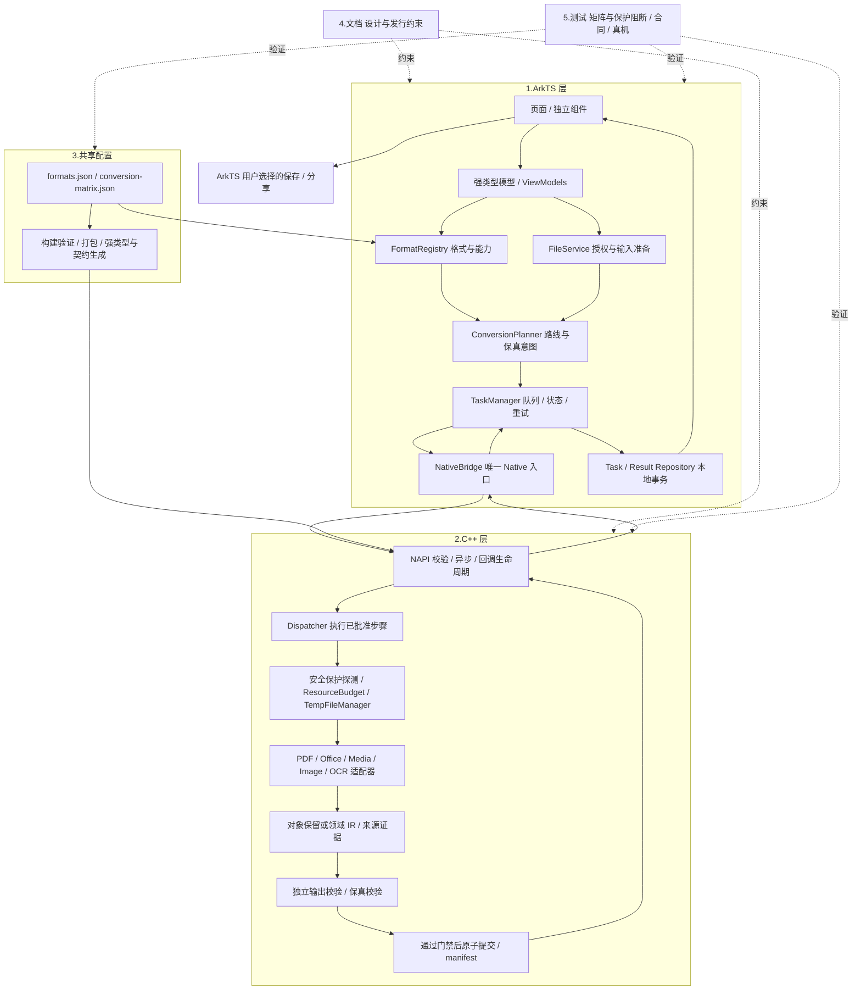
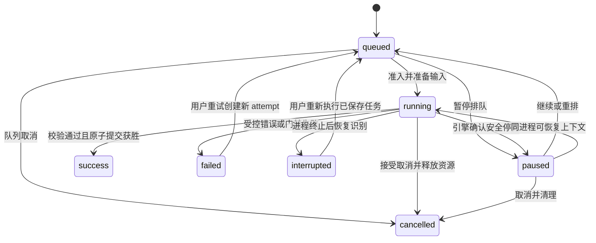
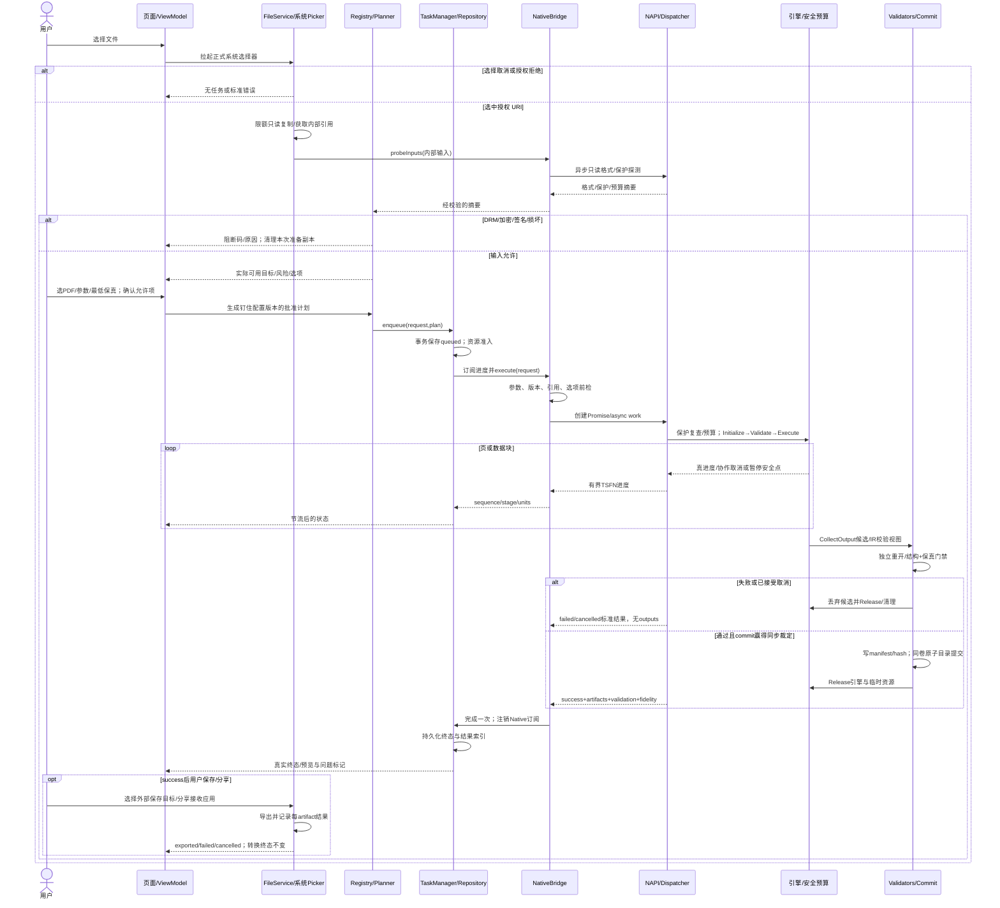
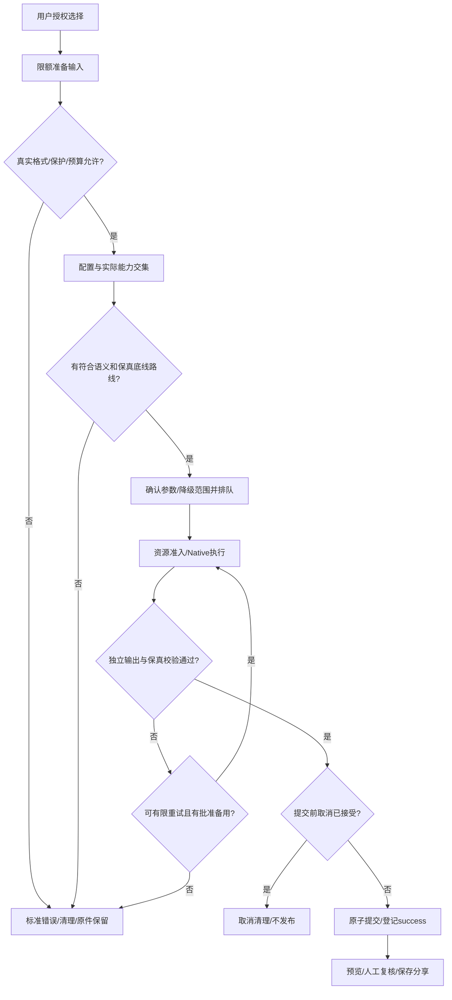

# 架构与分层设计

来源：本交付包主方案，2026-09-28。设计稿，非已实现/已验收声明。本文由 tools/assemble-docs.cjs 生成，修改主方案后重新生成。

### 整体架构图与分层数据流



业务数据流：授权 URI → 应用内 fileId/输入引用 → 识别与保护摘要 → 配置/能力快照 → 不可变计划 → Native DTO → 候选输出 → 校验报告 → 已提交 artifact 清单 → 预览/外部导出。文件二进制始终走 fd/内部文件与流，NAPI 不传整份文档或整页图像数组。

分层数据流图（箭头标注传输对象与文件所有权边界）：


依赖方向：页面只依赖 ViewModel；组件只接收值与事件；服务依赖接口、模型和平台封装；NativeBridge 独占 native so import；引擎不依赖 ArkTS、数据库/UI、用户 URI 或商业规则。Native 安全策略是边界约束，Native Dispatcher 只校验并执行批准计划；路线选择、批量优先级、自动重试和用户允许的降级留在 ArkTS。

建议目录映射（保持五大模块，在现有文件旁增补，不要求迁移全部旧文件）：

```text
entry/src/main/ets/
  pages/ components/ models/ viewmodels/
  services/{FormatRegistry,ConversionPlanner,TaskManager,NativeBridge,FileService}.ets
  platform/{FileAccess,BackgroundAdapter,PreviewAdapter}.ets
  repositories/{TaskRepository,ResultRepository}.ets
entry/src/main/cpp/
  napi/ types/libnative_bridge/ core/ ir/ security/ storage/ validators/
  engines/{pdf,office,media,image,ocr}/
shared/format-registry/{formats.json,conversion-matrix.json,schema/}
docs/{ARCHITECTURE,CONVERSION_MATRIX,AI_CODING_RULES,PRIVACY,
      ERROR_CODES,FIDELITY_POLICY,RELEASE_CHECKLIST}.md
tests/{unit,native,contracts,integration,fidelity,performance,fixtures}/
entry/src/{test,ohosTest}/
```

工程辅助的 hvigor/CMake/third_party/tools 不新增业务核心模块。每个依赖固定源码、版本、hash、补丁、ABI、编译参数、许可证和发行义务。

## 1.ArkTS 层：页面、组件、模型、格式注册、转换规划、任务管理、NativeBridge

### 页面

| 页面 | 主要数据与动作 | 状态/边界 |
| --- | --- | --- |
| HomePage | 导入、文件卡片、搜索、名称/时间/类型/大小排序 | 无授权全盘扫描；导入取消回到原态；删除只影响应用副本 |
| ConvertPage | 实际可用目标、质量偏好、转换意图、操作参数、降级说明 | 无 codec/未验收不显示目标；不相关参数不显示；输入校验后才排队 |
| TaskListPage | 排队、阶段、真实进度、暂停/取消/重试 | 是否能暂停由 capability 决定；运行取消显示“正在取消”直至确认 |
| PreviewPage | 主/多输出、校验状态、保真问题页、保存/分享状态 | 懒加载与缓存上限；Office 缺预览能力显示信息/导出；不伪装编辑器 |

历史可作为首页/任务页分区；设置使用统一路由附属页，满足计划而不增加空壳核心页面。Navigation + NavPathStack 管理栈，路由只携带 fileId/taskId/筛选快照，不传 fd、密码、PixelMap 或引擎对象；恢复从 Repository 重建。窄屏单栏、宽屏列表/详情分栏，布局随窗口尺寸调整，包含安全区、字体放大、读屏标签、焦点与大触控区域。[华为：Navigation 分栏](https://developer.huawei.com/consumer/cn/doc/doccenter-capabilities/arkts-navigation-split-mode)

### 组件与模型

基础组件：FilePickerAction、ProgressView、FormatPicker、ConfirmDialog、ErrorPanel。业务组件：ConversionCard、TaskItem、FidelityBadge、ArtifactList。组件 Props 是不可变视图数据，事件经显式回调/事件接口返回 ViewModel；不直接读取全局单例、打开文件、调用 Native 或写任务库。FilePickerAction 只触发选择事件，实际 Picker 由 FileService 执行。

MVVM：ViewModel 合并 TaskRepository 和服务事件，构造局部 UI 状态；模型验证格式、页范围、有限数值、预算、状态转移；视图只读绑定/发出意图。复杂参数用领域类型与白名单，不用自由字典。平台 JSON.parse 返回值不得未经验证断言成模型；生成 decoder 或显式验证器通过后逐字段构造 DTO。

核心模型与三端 Native 类型的完整设计声明见 `entry/src/main/ets/models/NativeProtocol.ets`。DocumentEntity 记录 fileId、显示名、源授权引用、受控副本、真实类型、大小与保护状态；ConversionTask 保存请求摘要、阶段、状态版本、尝试次数、计划/config hash、结果清单；FormatDefinition 定义配置元数据；Native 只接收准备好的内部输入，不接收显示名或任意外部路径。

### 格式注册

接口：`loadBundled()`、`getFormat(id)`、`listImportFormats()`、`queryTargets(input,operation)`、`getCapabilitySnapshot()`、`applyConfigPack(packRef)`、`setUserCapabilityEnabled(routeId,enabled)`。ID/后缀/MIME/默认参数/转换方向来自共享配置；Native 返回实际引擎与 codec 能力，不能直接把 JSON 中 planned 改为 available。

启动从 rawfile 读取构建生成副本；验证 schemaVersion、唯一 ID、必填字段、枚举、数值范围、引用完整性、阻断策略和图复杂度；校验成功一次性发布不可变快照并内存缓存。故障回退最近有效配置/随包基线，显示可追溯错误；禁止空表被当作支持全部。

热更新为本地导入的签名数据包/已交付配置激活：大小限制→hash/签名/版本/防回退→完整 schema/语义验证→能力交集重算→事务替换→通知页面。签名验证用成熟正式密码能力；不自行发明密码算法。已有任务钉住旧快照，新任务用新快照；强制安全禁用另有撤销策略，在 Native 执行前再次检查。更新不能扩大只读目录或取消 DRM 阻断规则。

### 转换规划

输入为实际格式与保护摘要、操作、目标、用户选项、意图、保真底线、资源与快照。输出不可变 ConversionPlan，包含 routeId、依赖引擎/步骤、估算预算、风险、fallbackRouteIds 和配置 hash。

规划算法：先拒绝保护/未知格式；以 operation + from + to 匹配合法路线；过滤 codec、版本、输入子集、意图与最低等级；同等级优先 direct，再按用户允许的损失、优先级、步骤数、实测成本排序。relay 只能由显式配置组成且中间类型一致，最多 3 步、去环；不对任意两种格式自动拼图。多文件：独立转换拆子任务；images_to_pdf/pdf_merge 保持多输入一个原子任务；批次父记录聚合成功/失败，不把批次部分成功标成全部成功。

降级：同意图、同最低等级的备用引擎可自动切换；需要牺牲内容/编辑性/版式时先展示具体差异并取得用户选择，不接受就失败。释放上一尝试全部资源后才重试；每任务默认最多 2 次尝试（含首次），禁止主备路线来回循环。权限/保护/密码/损坏/非法参数不自动重试；临时 I/O 或尚未执行的资源压力可有限等待重试。

### 任务管理

六个用户核心状态保持为 queued/running/paused/cancelled/success/failed。补充 interrupted 表示系统/进程中断；preparing/executing/validating/committing 为 running 内部阶段；pausing/cancelling 是控制请求标记，不伪造已生效状态。



TaskRepository 用 RDB 事务保存 taskId、batchId、state、stage、stateVersion、attempt、requestSummary、configVersion/hash、时间、manifestRef、错误码；不会保存密码、正文或远程遥测。状态更新 CAS/版本检查，终态单次确定。数据库表包括 tasks、task_attempts、artifacts、export_records；外部导出状态 pending/exporting/exported/failed/cancelled 单独管理。

默认 1 个重型任务；线程预算由 Native ResourceBudget 二次准入；只有完成线程安全/资源实测的轻任务可增加并发。不并叠 ArkTS Worker 池、TaskPool 与无限 Native 线程池。防饥饿采用用户优先级加排队时间老化；无资源时等待，不能偷偷降低已承诺保真度。

暂停：排队暂停立即生效；运行暂停由引擎声明 supportsPause，并在页/阶段等安全点确认。无暂停能力时禁用按钮，提供取消与重新执行。断点预留 checkpoint schema、输入 hash、引擎/config 版本、已完成阶段/页、校验和；恢复只复用已验证的阶段产物，不序列化任意引擎内存。

进程恢复：扫描合法 manifest 并核对内部结果；运行/验证/提交未完成任务记 interrupted，清理半成品；已原子提交但数据库未登记的结果可经完整门禁与 manifest 复核补索引，不能重新假定成功。后台策略由 BackgroundAdapter 根据设备、API、场景、授权选择；不把本地转换假扮网络传输或播放。旧版 TASK_KEEPING 仅对2in1的约束、新版媒体特殊场景都须按实际资格核对，不能套用于所有 PDF/Office 任务。[华为：后台任务 API](https://developer.huawei.com/consumer/cn/doc/harmonyos-references-V14/js-apis-resourceschedule-backgroundtaskmanager-V14)、[华为：视频后台导出场景](https://developer.huawei.com/consumer/cn/doc/best-practices/bpta-video-background-export)

### NativeBridge

NativeBridge 独占 so 模块；包装强类型调用、所有参数前检、领域错误归一化、Promise 完成、进度订阅、引用释放及 env 销毁。Page 离开只注销页面订阅和预览引用，仍运行任务的上下文由 TaskManager 持有；明确取消/服务关闭才发 Native cancel。不能把页面销毁当作静默杀死整个队列。

| 接口 | 契约与线程 | 主要异常 |
| --- | --- | --- |
| `initializeSession(init)` | 仅受信任平台服务传入当前应用真实私有根目录；Native规范化并绑定允许根与config hash，返回sessionId | 非应用根、版本错误、配置不一致 |
| `registerWorkspace(grant)` | FileService创建随机任务目录后，Native验证相对目录、所有权/边界并返回workspaceRef；只用于本task/attempt | 路径逃逸、重复或无效session |
| `getCapabilities(request)` | 异步，protocol/config 版本、ABI、引擎、codec、输入子集、暂停/检查点、offlineOnly 布尔值 | 协议/ABI/引擎加载错误 |
| `probeInputs(request)` | 异步、只读有限探测；真实格式/页数/保护/预算摘要，完整保护检查仍在执行前完成 | 损坏、权限、超预算；摘要不得泄漏正文 |
| `execute(request)` | 异步执行批准计划；resolve 标准 success/failed/cancelled 终态结果；未通过门禁 outputs 为空 | 业务失败放 result.error；绑定/调用环境错误归一化为 BridgeError |
| `subscribeProgress(taskId,listener)` | env 所属线程建订阅，返回 token；有界 TSFN 分发 | 无效任务/销毁环境 |
| `unsubscribeProgress(token)` | 幂等注销，清理引用；页面销毁调用 | token 不存在返回 false |
| `cancel(taskId,attemptId)` | 异步 ack accepted/too_late/not_found；accepted 后等待终态 cancelled | 不把 ack 当成已清理 |
| `pause/resume(taskId,attemptId)` | 异步能力门控，确认安全点后更新状态 | 不支持返回 UNSUPPORTED_FEATURE |
| `releaseTask(taskId,attemptId)` | 异步幂等，终态清理 handles/订阅；活动任务拒绝，不能绕过 cancel | TASK_BUSY |
| `releaseArtifact(ref)` | 释放预览/读 handle；不删除持久结果 | 已释放幂等 |
| `shutdown()` | 关闭准入→协作取消→取消订阅→清理 async/ref；env 析构最后兜底 | 引擎不协作记录隔离风险 |

密码接口不进入 V1.0 发布 API；未来使用独立临时密钥句柄，避免不可擦除 ArkTS 字符串在模型/历史中复制。

## 2.C++ 层：NAPI 入口、转换器接口、错误码、IR 结构、资源限制、保真校验、PDF/Office/Media/Image/OCR 引擎占位

### NAPI 入口与执行模型

输入解析在 env 所属线程完成：检查参数个数、类型、有限值、枚举、大小、版本和工作区凭证；转换为纯 C++ DTO 后排入 async work。execute 回调不访问 napi_value/原线程 env；只操作 C++ 对象、fd 和有限缓冲。complete 回到创建 env 的线程映射结果、resolve 一次、删除 work/ref。NAPI 每次调用检查 napi_status；pending exception 与常规错误区别处理；所有导出边界和工作函数捕获 std::bad_alloc/std::exception/未知 C++ 异常。

进度线程安全函数使用有限队列、非阻塞投递、覆盖合并旧进度；建议最多 5 次/秒/任务，阶段变化即时投递；终态通过 Promise/任务存储可靠送达，不能因进度队列满丢掉完成结果。sequence 按 attempt 单调递增，订阅端丢弃旧 attempt/重复序列；未知总量用不定进度。

所有 NativeTaskContext 使用 shared_ptr 维持 async/work/control 的共同生命周期；转换器/临时文件/fd 使用 unique_ptr/RAII；napi_ref 和 TSFN 按所属 env 清理，不在任意线程析构时随意调用 NAPI。禁止 detach 后不受管控的工作线程。模块卸载/Ability 销毁发生时，先停止回调入口、请求取消，再释放 task 服务持有的引用。

首版可移植 core 使用 C++17，NAPI glue 独立目标。构建从目标 DevEco 模板生成，核对 module 注册、CMake 链接和 `.d.ts` 包声明；当前脚手架 `NAPI_MODULE(NODE_GYP_MODULE_NAME,...)` 不作为鸿蒙可用证据。[华为：Native 子线程与 UI 主线程交互](https://developer.huawei.com/consumer/cn/doc/doccenter-capabilities/native_subthread-to-uimain)

### 转换器接口与插件注册

完整 C++17 契约见 `entry/src/main/cpp/core/converter.h`，生命周期如下：

```cpp
class IConverter {
 public:
  virtual ~IConverter() = default;
  virtual ConverterCapabilities Describe() const = 0;
  virtual Status Initialize(const EngineInitContext&) = 0;
  virtual Status Validate(const ConvertRequest&, const TaskContext&) const = 0;
  virtual Status Execute(const ConvertRequest&, TaskContext&) = 0;
  virtual Result<CandidateOutput> CollectOutput(TaskContext&) = 0;
  virtual void Release() noexcept = 0;
};
```

五段式严格为 初始化→参数校验→执行转换→候选结果输出→资源释放。Describe 是元数据查询；独立 Validator/CommitCoordinator 才能判定全任务成功。CollectOutput 仅返回候选文件和校验视图，不创建 success、不注册历史、不导出用户目录。Release 幂等、无异常；部分初始化失败也必须释放；生命周期 guard 保证任意 return/throw 都执行清理。EngineAdapter 内部错误统一映射 Status，C ABI 不跨边界抛异常。

插件使用随包编译的 factory registry：每个引擎实现接口和声明 manifest，构建脚本从 manifests 生成注册项；核心 Dispatcher 不添加 if(format) 分支。每个步骤的engineIds声明依赖集合，executorEngineId指定负责该步骤的适配器；生成ApprovedPlan后仍保留这些字段，Native按config hash核对而不是隐式猜测。已有 engine 的新格式方向只改配置和适配器子集；新 engine 新增实现、manifest 与构建目标，正常发版。严禁运行时加载用户配置中的任意 so 路径。第三方只访问任务能力句柄与预算分配器；协议主版本不兼容拒绝加载，minor 新字段必须可降级理解。

### 错误码与全链路异常

稳定机器码为跨语言真值；Native 枚举有显式整数，映射固定字符串，文案用 messageKey 在 ArkTS 本地化；不把第三方原始错误/敏感堆栈直接展示。现有九个字符串错误码全部保留；扩展表见文档模块。错误对象含 code、reason、module、stage、retryable、traceId、脱敏 detailKey，不包含正文、路径、密码。

输入/授权/探测/规划/准入/引擎/校验/提交/导出每层都捕获并映射。文件部分损坏只有引擎支持容错且用户选择内容恢复、关键安全检查通过时才允许候选；失败内容不得以成功文件悄悄发布。原生 SIGSEGV/系统 OOM 由诊断与启动恢复处理，不能宣传为 catch 可捕获。

### IR 结构与序列化

DocumentIR 顶层 schemaVersion、documentId、sourceFormats、flow/fixed、styles、resources、provenance、unsupportedFeatures；语义、样式和资源完整分离并相互引用。资源引用仅是 taskResourceId/hash/type/尺寸，不包含外部绝对路径；实际内容按页/块分片存储，不用巨大 JSON/Base64 传到 ArkTS。

| IR | 内容与约束 |
| --- | --- |
| FlowDocumentIR | sections、段落/runs、标题/列表、表格、锚定对象、分节/分栏、页眉页脚、分页约束；明确自动分页与源分页不同 |
| FixedDocumentIR | pageBox/CropBox、rotation、文本 glyph/bbox、图片/矢量、z-order、transform、阅读顺序；保持页面几何 |
| StyleIR | 原属性与 resolved 属性、主题/继承引用、显式关闭/清空/缺省、字体候选、字重、段落/字符样式；循环引用受限 |
| TableIR | rows/columns/cells、rowSpan/colSpan、边框、填充、宽高、对齐、表头与跨页规则；跨度合法、无重叠 |
| ResourceIR | 图片/字体/参考渲染/附件的局部 ID、hash、授权/嵌入限制；外链默认不解析 |
| ProvenanceIR | 来源页/元素、解析/推断方法、置信度原值/校准版本、降级理由、未知特性与证据引用 |
| MediaIR / ImageIR | 媒体容器/流/codec/timebase/duration/采样；图像像素/方向/色彩/透明/帧信息；不套文档排版指标 |

几何统一 pt、左上原点、x 向右/y 向下；保留原坐标与变换。1in=72pt，1twip=0.05pt，1pt=12700EMU，pixel=pt×DPI/72。PDF 坐标必须综合页框、旋转与仿射变换；屏幕 vp 不参与排版。浮点值要求 finite，精度/舍入按路径定义。

Office 路线：成熟本地排版优先；子集必须正确解析 OOXML 包关系、Content Types、主题、basedOn 属性继承、直接格式、编号、节、母版/布局、组合变换。HarfBuzz/FreeType 等仅是候选的成形/字度量基础，不能当作完整 Word 排版引擎；实际第三方组合仍需目标 ABI/许可证 PoC。中文禁则、kerning、字体 fallback、keep/widow-orphan、表格跨页与浮动环绕要有明确实现边界。公式/SmartArt/嵌入对象/修订等不能保留时记录 unsupported，关键损失按策略拒绝。

IR 序列化采用版本化、结构化、分片 JSON 清单加二进制资源；写出 hash/长度/枚举/坐标范围、引用完整性与最大嵌套限制，读入先验证再构造。round-trip 测试验证结构/样式/资源/来源，不承诺格式无损。任务中断只保留有版本/hash 的已验证阶段检查点；终态清理临时 IR，持久保真报告可能敏感，按结果文件同级保护。

### 资源限制与文件提交

下表是 **待真机标定的保守初始预算**，不是已测性能或所有设备保证。由共享资源 profile 提供，Native 取平台/安全上限与请求较小值，不能由用户任意增大硬上限。

| 预算 | 初始 profile | 执行策略 |
| --- | --- | --- |
| 单输入/批次累计 | 100MiB / 300MiB | 选择后估算、复制过程中计量，达到上限停止 |
| PDF 页数/批次图数 | 300 / 100 | 探测受控，分页处理；过限提示分批 |
| 单页像素 | 1600万 | 检查宽×高×通道 overflow；解码前与实际 decode 再检查 |
| 每任务 Native 管理预算 | 192MiB；软线 153MiB | 估算 admit；运行计量；软线缩缓存/排队；硬线可协作终止 |
| 应用总内存初始目标 | 峰值 PSS ≤384MiB（最低目标设备） | 包含 ArkTS/Native/codec/缓存；外部引擎分配不能只靠自有 allocator 统计，配系统采样实测 |
| 引擎线程/并发 | 每任务最多2线程、重型并发1 | 引擎内部线程也算入；库无法控制时拒绝合入发布配置 |
| 临时磁盘 | 单任务512MiB；全局1GiB；保留至少128MiB空闲 | 写入持续复核；系统 ENOSPC 映射 STORAGE_FULL，不只启动检查 |
| ZIP/OOXML | 解压累计256MiB、条目10000、嵌套4、压缩比100 | 对压缩炸弹、Zip Slip、symlink、外部实体/关系拒绝；比值是风险门，不代替累计限额 |
| 单 attempt 耗时 | 180s 初值，路径可设更小 | 超时请求取消；只能在引擎安全点生效，不靠 timer 杀线程 |
| 预览缓存/日志 | 图缓存32MiB、日志8MiB轮转 | LRU/显式释放；页面退出不保留 PixelMap |

支持流式 IO、逐页渲染、小缓冲解码/编码、有界缓存。RAII 包装 fd、引擎对象、内存、临时目录；工具 Sanitizer 在支持的 host/target 环境使用，host 检查不替代设备。降 DPI/丢元数据/位图化均可能改变保真承诺，需符合预先批准策略；压力优先缩缓存、降低并发、排队，其次用户选择降级，最后安全失败。

文件授权在 ArkTS 使用 Picker/fileIo 正式 API；URI 不截字符串当路径；Native 只收应用内生成并校验的 workspace 相对路径/目录句柄与输入 fd。PathGuard 验证真实目录边界和访问所有权，拒绝 traversal、绝对路径、symlink 与 TOCTOU；Native 内部 dup fd 后独占拥有，调用侧 fd 持有至握手完成再关闭。

结果事务：任务 `staging/task-attempt/` → 写候选 → close/flush → 输出重开校验 → 按保真 policy 判定 → manifest+hash 落盘 → 同一文件系统 rename 整个结果目录 → Repository 索引。外部 Picker 保存可能不原子：逐文件记录成功/失败，保留应用内合格结果，清理自身可控的半成品；无外部删除授权时提示用户检查，不能保证强删其他提供者文件。

取消和提交共享 mutex/单一 commit state：提交获胜则返回 too_late 并维持 success；提交前接受取消则不得发布 success，候选清理完毕才 cancelled。多个输出一次目录提交，禁止发布半套转换结果。启动清理仅遍历应用任务目录，跳过有活跃租约的任务；损坏 manifest、断电、cleanup 失败记录可追踪待清理，后台/下次启动继续安全清理。

### 保真校验

OutputValidator 先验证输出真格式、独立重开/解析、页/图片/音频流完整性、资源引用、OOXML 包结构与请求一致；不以“非空”判成功。FidelityValidator 从源探测/IR 与独立输出视图测量语义、样式和视觉；直接转换使用对象/页面/图片视图，不为验证破坏原对象。

报告字段：intent、requested/achievedTier、source/output 页数、指标状态/分母/算法版本、字体替换、文本缺失/额外/顺序、图片区域匹配、表格拓扑、版式差异、可编辑性、未知/降级项、需要人工复核、engine/validator 版本、evidenceRefs。measured/estimated/unavailable/not_applicable 四状态，不可用不填 0 或100%。

通过策略：硬结构错误、关键内容丢失或最低等级未达到→failed/OUTPUT_VALIDATION_FAILED，不注册候选；经用户预先允许的轻微降级→success+warnings+requiresManualReview；高风险 unavailable 指标不能按通过处理。每条 route 独立 profile，文档提取不考分页、图片不考文字、音频不考表格。

### PDF/Office/Media/Image/OCR 引擎占位

| 引擎 | 输入/输出契约 | 候选依赖与 PoC | 能力边界与桩行为 |
| --- | --- | --- | --- |
| PDF | PDF 输入引用+页集/渲染参数；候选 PDF、逐页图或文本+FixedIR摘要 | PDFium 等渲染/读写候选，拆分/合并/写出能力独立核验，不能假设单库包办 | 受保护先阻断；页框/旋转/字体；不承诺 PDF/A、签名保持或所有交互表单 |
| Office | DOCX/PPTX 或 Fixed/Flow IR；PDF/OOXML/文本候选与特性报告 | 成熟离线可发行引擎优先；结构库+成形+有边界排版只作子集 PoC | 不包含 DOC/PPT；宏不执行；关键复杂元素拒绝；整页视觉与编辑重建分路 |
| Media | 内部音频输入+codec/container/options；音频候选+MediaIR | 目标系统 Native codec；不足时 FFmpeg 库裁剪构建，审计全部编译选项 | MP3读写分别探测；M4A/OGG 容器与codec分开；流式/flush；不 DRM、不 TTS/ASR |
| Image | 编码图像输入+方向/ICC/alpha/输出参数；编码图像或图片PDF页面数据 | 正式 Image Native API/可交叉编译库；验证编码端能力 | 透明→JPEG 明示底色；动画多帧不隐瞒；不执行 SVG 脚本/外链 |
| OCR | 授权页图/扫描区域+语言/模型ID；text/bbox/原置信度/表格提示+Provenance | 本地模型/成熟候选 ABI PoC，随包/正式安装交付 | 先简中/英文；混合页去重；不把置信度当准确率；缺模型 unavailable |

各桩实现返回同一受控 `ENGINE_MISSING`、Describe.available=false、真实缺失原因；不得写空白/假输出。模拟成功引擎只在 test build 注册，release gate 自动拒绝。系统编解码能力采用 C++ 可调用的正式 Native API/适配器；ArkTS 可持有平台预览/授权对象，但不承担转换核心。

候选依赖专项约束：PDFium 官方当前主分支使用 GN/Ninja，默认构建包含 JavaScript/XFA 且采用 C++20；本产品若选用，应固定commit与参数，关闭pdf_enable_v8/pdf_enable_xfa等不需要的活动内容能力，按目标Clang验证。核心契约维持C++17，后端单独构建其所需标准，通过公开C API/适配器隔离；官方通用平台构建说明不等于HarmonyOS发行构建已被证明。[PDFium官方构建说明](https://pdfium.googlesource.com/pdfium/+/refs/heads/main/README.md)

FFmpeg仅为候选，发行许可证取决于实际启用组件与附加库；项目策略排除enable-gpl/enable-nonfree及不可再分发组合，审查LGPL对应源码、链接和替换/再链接等义务后才能使用。并不因为“免费应用”免除发行义务。[FFmpeg官方发行说明](https://ffmpeg.org/legal.html)

## 单文件完整转换时序与流程

以下以单张 PNG→PDF 为例，合并/多图输入复用同一契约；拆分/逐页输出使用 outputs[]。




