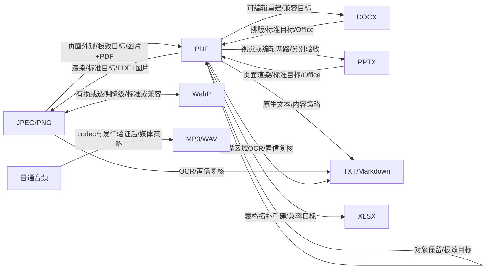

# 转换矩阵：用户版与开发版

来源：本交付包主方案，2026-09-28。设计稿，非已实现/已验收声明。本文由 tools/assemble-docs.cjs 生成，修改主方案后重新生成。

### 转换矩阵文档：用户版与开发版

用户版仅展示发布已验收路线，用“保留页面外观/可编辑重建/提取内容”“转换会改变什么”“是否需要人工复核”说明，不展示引擎实现细节。研发版保留 planned 路线与每 routeId 的引擎版本、ABI、输入子集、codec、参数、限制、保真 profile、失败码、测试报告和状态。

以下是目标路线图，不是当前可用功能图；灰色规划能力由实际验收逐条开放：

| 操作族 | 输入→输出 | 依赖 | 目标等级 | 已知限制/开放阶段 |
| --- | --- | --- | --- | --- |
| images_to_pdf | JPEG/PNG→PDF；WebP 后接 | image+pdf writer | extreme（子集） | 实际保留所有输入与顺序；不得重编码却声称无损；M1 |
| render | PDF→PNG/JPEG | pdf+image encoder | standard | DPI、裁切、字体、alpha；静态外观、不可编辑；M2 |
| split/merge | PDF→PDF | pdf object copy | extreme（子集） | 明确书签、链接、表单重映射；含签名/加密阻断；M2 |
| image_convert | JPEG/PNG/WebP 逐边 | image codecs | standard/compatible | JPEG有损、透明背景、ICC/元数据处理；M2 |
| office_render | DOCX/PPTX→PDF | office layout+pdf | standard（目标） | 字体与OOXML子集；不可发行则 unavailable；M3 |
| rebuild | PDF→DOCX/PPTX | pdf+office writer，必要时OCR | compatible | 语义推断/可编辑性受限；全页图模式独立 route；M3 |
| content | PDF/DOCX/PPTX→TXT/MD，DOCX↔PPTX | extraction+writer | compatible（内容语义） | 不承诺分页、完整样式与所有关系；M3 |
| table | PDF→XLSX | pdf/table+OOXML writer | compatible | 合并单元格/数值类型/跨页需证据；M4 |
| ocr | 图片/扫描PDF→TXT/DOCX | image+ocr+writer | compatible | 模型首次离线、低置信人工复核；M4 |
| audio | 原矩阵普通音频→MP3/WAV | media codec+container | standard/compatible | 原7条音频边保留；M2 PoC后按边开放，列P2扩展 |

后缀不是操作：PDF→PDF 中 split/merge/encrypt/decrypt 必须不同 operation。V1.0 无 encrypt/decrypt available 路线。发布文案不能把 DOCX 支持写成 DOC、PPTX 写成 PPT，不能宣称音频任意互转或整页截图可编辑。

## 配置中的全部43条设计路线

| routeId | 输入 | 输出 | 操作 | 形态/意图 | 等级/引擎 | 阶段/状态 |
| --- | --- | --- | --- | --- | --- | --- |
| jpeg-pdf | jpeg | pdf | images_to_pdf | direct/layout_preserved | extreme/image+pdf | M1/planned |
| png-pdf | png | pdf | images_to_pdf | direct/layout_preserved | extreme/image+pdf | M1/planned |
| mixed-images-pdf | jpeg/png | pdf | images_to_pdf | direct/layout_preserved | extreme/image+pdf | M1/planned |
| pdf-png | pdf | png | convert | direct/layout_preserved | standard/pdf+image | M2/planned |
| pdf-jpeg | pdf | jpeg | convert | direct/layout_preserved | standard/pdf+image | M2/planned |
| pdf_split | pdf | pdf | pdf_split | direct/layout_preserved | extreme/pdf | M2/planned |
| pdf_merge | pdf | pdf | pdf_merge | direct/layout_preserved | extreme/pdf | M2/planned |
| jpeg-png | jpeg | png | convert | direct/layout_preserved | standard/image | M2/planned |
| jpeg-webp | jpeg | webp | convert | direct/layout_preserved | compatible/image | M2/planned |
| png-jpeg | png | jpeg | convert | direct/layout_preserved | compatible/image | M2/planned |
| png-webp | png | webp | convert | direct/layout_preserved | compatible/image | M2/planned |
| webp-jpeg | webp | jpeg | convert | direct/layout_preserved | compatible/image | M2/planned |
| webp-png | webp | png | convert | direct/layout_preserved | standard/image | M2/planned |
| webp-pdf | webp | pdf | images_to_pdf | direct/layout_preserved | extreme/image+pdf | M2/planned |
| docx-pdf | docx | pdf | convert | direct/layout_preserved | standard/office+pdf | M3/planned |
| pptx-pdf | pptx | pdf | convert | direct/layout_preserved | standard/office+pdf | M3/planned |
| pdf-docx | pdf | docx | convert | direct/structured_rebuild | compatible/pdf+office | M3/planned |
| pdf-pptx | pdf | pptx | convert | direct/structured_rebuild | compatible/pdf+office | M3/planned |
| pdf-pptx-visual | pdf | pptx | convert | direct/layout_preserved | standard/pdf+image+office | M3/planned |
| pdf-txt | pdf | txt | extract_text | direct/content_only | compatible/pdf | M3/planned |
| pdf-md | pdf | md | extract_text | direct/content_only | compatible/pdf | M3/planned |
| docx-txt | docx | txt | extract_text | direct/content_only | compatible/office | M3/planned |
| docx-md | docx | md | extract_text | direct/content_only | compatible/office | M3/planned |
| pptx-txt | pptx | txt | extract_text | direct/content_only | compatible/office | M3/planned |
| pptx-md | pptx | md | extract_text | direct/content_only | compatible/office | M3/planned |
| docx-pptx | docx | pptx | convert | direct/content_only | compatible/office | M3/planned |
| pptx-docx | pptx | docx | convert | direct/content_only | compatible/office | M3/planned |
| pdf-xlsx | pdf | xlsx | convert | direct/structured_rebuild | compatible/pdf+office | M4/planned |
| mp3-wav | mp3 | wav | convert | direct/content_only | compatible/media | M2/planned |
| wav-mp3 | wav | mp3 | convert | direct/content_only | compatible/media | M2/planned |
| flac-mp3 | flac | mp3 | convert | direct/content_only | compatible/media | M2/planned |
| aac-mp3 | aac | mp3 | convert | direct/content_only | compatible/media | M2/planned |
| m4a-mp3 | m4a | mp3 | convert | direct/content_only | compatible/media | M2/planned |
| ogg-mp3 | ogg | mp3 | convert | direct/content_only | compatible/media | M2/planned |
| opus-mp3 | opus | mp3 | convert | direct/content_only | compatible/media | M2/planned |
| png-txt-ocr | png | txt | ocr_extract | direct/content_only | compatible/image+ocr | M4/planned |
| png-docx-ocr | png | docx | ocr_extract | direct/content_only | compatible/image+ocr+office | M4/planned |
| jpeg-txt-ocr | jpeg | txt | ocr_extract | direct/content_only | compatible/image+ocr | M4/planned |
| jpeg-docx-ocr | jpeg | docx | ocr_extract | direct/content_only | compatible/image+ocr+office | M4/planned |
| pdf-txt-ocr | pdf | txt | ocr_extract | direct/content_only | compatible/pdf+image+ocr | M4/planned |
| pdf-docx-ocr | pdf | docx | ocr_extract | direct/content_only | compatible/pdf+image+ocr+office | M4/planned |
| png-pdf-alternate | png | pdf | images_to_pdf | direct/layout_preserved | extreme/image+pdf | M2/planned |
| png-pdf-compatible | png | pdf | images_to_pdf | relay/layout_preserved | compatible/image+pdf | M2/planned |

这些是设计目标。正式开发版需逐route补齐inputSubset、具体engine版本/ABI/codec、已知限制、fixture与验收证据；当前全部planned。
