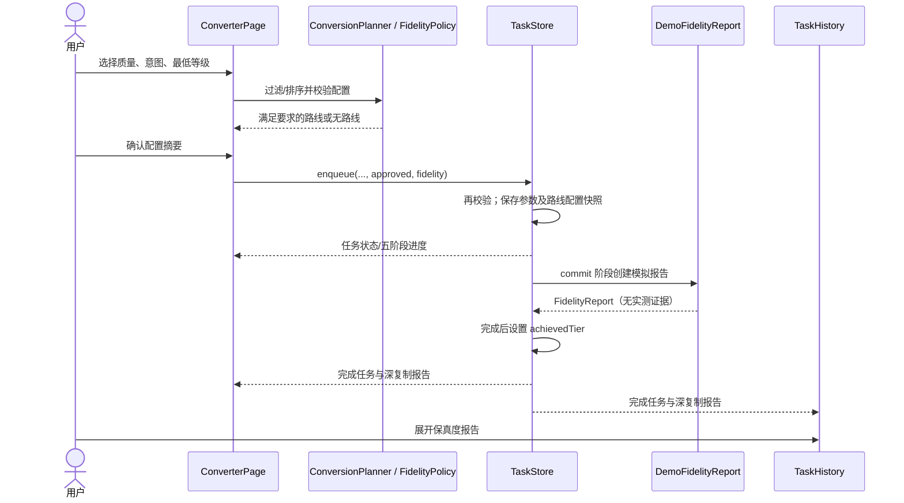

# 保真度控制与参数管道

日期：2026-09-29。开发工程：`D:/HarmonyOS/harmonyOS`。

本轮进一步合并单个 FidelitySettingsVM、改为递归调度并扩展独立测试；最新状态及变更范围见[审计改进与验证说明](审计改进与验证说明.md)。下文“保持基线字节一致”指历史保真度功能开发轮次。

后续优化已将面板移到 FidelitySettingsCard，并将快照复制移到 DemoTask.clone()/FidelityReportSnapshot；TaskStore 另有通过能力与输入门禁保护的 Native 预留分支。下文演示管道继续有效，新增契约及验证边界见[组件与任务调度优化说明](组件与任务调度优化说明.md)。

转换页实现选项、参数校验、任务快照与模拟报告。所有 FidelityTier、Intent、QualityMode、FidelityReport、Metric 均直接复用 NativeProtocol.ets；没有改变协议或格式配置。该页面继续走 demo，不调用 Native.execute；五个页面及此前任务控制继续保留。

## 操作规则

转换页在目标格式与文件名之间提供“保真度设置”折叠面板，默认展开。三档质量模式为快速、均衡、高保真；默认均衡，演示活动时长分别为 2000、3500、6000 毫秒，不含暂停和排队时间。

转换意图只提供当前源/目标组合已配置的意图。源或目标变化时，意图与最低等级取该组合首条路线的默认值。最低期望等级可选极致保真、标准保真、兼容保真；等级低于期望的路线被过滤，无满足路线时禁止开始。质量模式不会改变路线等级或用户意图；高保真模式也不能使兼容路线获得极致保真能力。

面板持续显示路线规划等级、直转/中转、转换意图。路线带 requiresUserApproval 时仍须单独勾选兼容降级同意；修改设置或路线后需要重新确认。开始按钮先校验文件名、路线、保真选项及降级同意，再弹出完整摘要；确认时使用已保存的提交快照。预览器弹窗抛异常时显示相同内容的内联确认，仍需主动确认。

## 文件职责

| 文件（相对 entry/src/main/ets） | 本轮职责 |
| --- | --- |
| pages/ConverterPage.ets | @State 选项、配置面板、路线提示、确认快照、参数提交、完成报告 |
| models/InteractionModels.ets | FidelitySelection、DemoSubmission、DemoTask 保真字段、可选导航 qualityMode |
| viewmodel/ConversionPlanner.ets | 同意图/最低等级过滤、质量模式排序、bestRoute；默认排序兼容原调用 |
| viewmodel/FidelityPolicy.ets | 标签、等级顺序、三档演示时长、枚举/意图/最低等级校验 |
| viewmodel/TaskStore.ets | enqueue 参数、配置快照、不同活动时长、commit 报告、深复制、取消清理 |
| viewmodel/DemoFidelityReport.ets | 生成标明未实测的结构化示例报告，复制嵌套字段 |
| components/QualitySelector.ets | 属性/回调隔离的三档选择器 |
| components/FidelityReportCard.ets | 可展开摘要、指标、降级、字体记录及限制 |
| pages/TaskHistory.ets | 展示任务选项和完成报告，保留原任务控制 |

NativeProtocol.ets、RegistryTypes.ets、generated/RegistryData.ets、NativeBridge.ets、converter.h、FeatureGuide.ets、main_pages.json 保持基线字节一致。build() 与 @Builder 只描述界面，选项数组、路线说明与报告行在事件处理/生命周期方法中准备。

## 数据传递契约



```typescript
// 类型由 NativeProtocol 导入；此处只展示参数载体与调用约定。
interface FidelitySelection {
  qualityMode: QualityMode;
  requestedIntent: Intent;
  requestedTier: FidelityTier;
}

TaskStore.shared().enqueue(fileName, sourceId, targetId, routeId, approved, {
  qualityMode: 'balanced',
  requestedIntent: 'layout_preserved',
  requestedTier: 'standard'
});
```

enqueue 的第六参数可选，保持旧调用兼容；缺省取 balanced、route.intent、route.fidelityTier。DemoTask 同时保存 intent 与 requestedIntent，二者在演示任务中一致；requestedTier 是用户最低期望，不是路线能力。private timing 保存 plannedTier 和降级数组副本，使运行中注册数据的变化不会篡改已提交任务。

任务通过活动耗时计算进度，85% 起进入 commit 并生成报告，100% 完成后才对 DemoTask 设置 achievedTier。外部 snapshot 深复制报告、指标及全部数组；调用者修改返回数据不会污染内部任务。commit 后取消或 shutdown 清除临时报告和 achievedTier，任务不会再次完成。

| 参数校验失败 | 标准错误码 | reason |
| --- | --- | --- |
| 无效 QualityMode/Intent/FidelityTier | INVALID_REQUEST | FIDELITY_OPTIONS_INVALID |
| 选择意图与路线不符 | UNSUPPORTED_FEATURE | FIDELITY_INTENT_MISMATCH |
| 路线达不到最低期望等级 | UNSUPPORTED_FEATURE | FIDELITY_TIER_UNAVAILABLE |
| 降级未获同意 | INVALID_REQUEST | DEMO_APPROVAL_REQUIRED |

规划失败不会悄悄换意图或降级。routes(..., qualityMode, preferredIntent, minimumTier) 返回符合筛选的路线；bestRoute(sourceId, targetId, preferredIntent, qualityMode, minimumTier) 无候选时返回 undefined。快速排序按步骤数，高保真在指定的同一意图内按规划等级，其后直转优先及 priority 升序；这只是规划启发式，没有真实性能评估。

## 模拟报告的边界

报告的 achievedTier 是路线快照的示例等级，界面标为“示例等级”。示例比例按路线等级固定生成，不随质量模式虚构精度提升：极致/标准/兼容分别 98%/90%/76%，对应指标 state=estimated，algorithmVersion=demo-example-v1。仅提取内容的布局指标为 not_applicable，无比例值。

真实页数 state=unavailable，源/输出页数不填；fontSubstitutions=[] 仅表示示例没有记录，并非没有发生字体替换。unsupportedFeatures 明确提示未解析实际文件，degradations 复制路线的允许降级配置，requiresManualReview=true，evidenceRefs=[]。界面同时说明未实测、固定示例、字体与页数未检测，不将这些数据用于真实保真验收。

Native 预留入口接收已有的 ConvertRequest：qualityMode、intent/plan.intent、plan.minimumTier 分别对应上述选择；NativeFidelityReport 读取 ConvertResult.fidelity，缺失则保持未知。当前未接通授权文件准备与真实引擎，不能从演示页面启用 Native，也未获得实测保真数据。

## 验证与人工验收

```powershell
node tests/check-interactions.cjs
node tests/check-fidelity.cjs
node tests/check-design.cjs
node tests/check-migration.cjs
powershell -NoProfile -File tools/inspect-hap.ps1
```

宿主检查执行真实非 UI ArkTS 源码，通过本机 DevEco TypeScript 转译及可控时钟验证；15 项交互检查和 13 项保真检查通过。保真用例覆盖三档精确活动时长、commit/完成时序、等级不足、意图不符、无效枚举、输入/路线快照、深复制、降级同意、内容提取指标、取消/shutdown、暂停与混合队列以及受保护文件哈希。实际 Hvigor assembleHap 已通过，控制台日志为 tests/generated/fidelity-build.log。详细证据见 tests/generated 下的 fidelity-check-report.json、build-check-report.json、hap-package-report.json。

尚未执行 Previewer 点击、布局检查或设备运行；以下是待人工验证的操作，不是已通过的设备测试。

| 操作 | 预期 |
| --- | --- |
| PDF→PNG，均衡/保留布局/标准 | 摘要一致，约 3.5 秒完成，两页均可展开示例报告 |
| PDF→PNG，快速与高保真分别运行 | 约 2/6 秒完成，等级仍为标准，示例比例不变 |
| PDF→PNG 最低选极致 | 提示无满足路线，开始按钮不可用 |
| PDF→PPTX 切换结构化重建/保留布局 | 只显示对应意图路线，切换后需重新确认 |
| PNG→PDF 最低兼容，手选兼容中转 | 未同意降级时不能开始，同意后报告列出 alpha_flatten/jpeg_reencode |
| 运行中暂停/继续/取消 | 暂停时间不计入活动耗时，取消后无完成报告 |
| 点击开始后返回修改 | 不产生新任务；再次开始显示新配置摘要 |

当前 HAP 未签名，安装调试仍需合法调试签名。演示不读取/输出文档，会话历史未持久化；关闭应用不保留任务。改动前快照位于 D:/HarmonyOS/migration-backups/harmonyOS-before-fidelity-20260929-093220。
