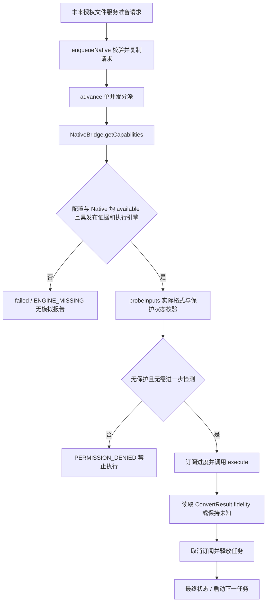

# 组件与任务调度优化说明

日期：2026-09-29。工程：`D:/HarmonyOS/harmonyOS`。本文保留上一轮组件拆分与 Native 预留调度记录；最新改进见[审计改进与验证说明](审计改进与验证说明.md)。当前面板已合并为单个 VM，调度为 50ms 首次/200ms 后续递归超时，核心测试扩展到 55 用例；原设计包和 Native 协议保持完整。

## 优化结果

| 项目 | 实际修改 |
| --- | --- |
| 面板拆分 | FidelitySettingsCard 接收模式、选项、摘要、忙碌状态与选择回调，内部仅管理展开状态；组合 QualitySelector，不访问 TaskStore 或规划器 |
| 集中克隆 | DemoTask 改为类，clone() 是唯一任务快照入口；TaskStore 不再枚举任务字段。FidelityReportSnapshot 深复制指标及所有数组，不依赖 demo 报告生成器 |
| 报告来源 | DemoFidelityReport 仅接受 demo；NativeFidelityReport 仅读取成功 ConvertResult.fidelity 并校验上下文/最低等级/指标，缺失报告不推断 achievedTier |
| Native 预留调度 | enqueueNative 保存准备好的请求，advance 根据 mode 分派；经 NativeTaskRunner 调用现有 NativeBridge.getCapabilities/probeInputs/execute 等接口。没有新建 convert 别名或改动 NAPI 协议 |
| 单元测试 | 新增 ConversionCore.test.ets 的 12 个 Hypium describe()/it() 用例，注册到本地及 ohosTest List 入口；增加 Native 分支宿主检查 |
| 国际化准备 | 保真度设置、质量/意图/等级、路线提示、报告和主要读屏文本使用 base/element/string.json；新增 en_US 对应条目，并检查键名及格式占位符一致 |
| 无障碍 | 面板、三档按钮、意图/最低等级 Select、报告展开按钮、源/目标/路线 Select、文件名输入、降级确认与部分任务控制加入 accessibilityText/Description；三档文本允许缩小字号 |

国际化范围是本轮相关组件与路线提示，首页、功能指南及旧任务提示尚未全部迁移。无障碍是源码标注与编译检查，仍需读屏和多语言布局验收。

## 数据与所有权

DemoTask 保留历史命名和原字段，mode 扩展为 demo/native；新增字段应在模型声明默认值及 clone() 中实现复制。ArkTS 不使用动态属性枚举或对象展开来复制模型，因此采用显式集中复制，并用宿主测试给字段设置不同值、比对完整字段集合和嵌套隔离，避免 Store 中遗漏字段。

任务提交后不可被外部修改：demo 保存选择及路线能力快照；native 将纯 JSON DTO 的 ConvertRequest 深复制，包含 options、plan、inputs 与 budget。Native 报告亦独立深复制，输入的 ConvertResult 之后发生变化不会改写 UI 快照。

## Native 分支的启用前提



请求必须使用正式授权 sessionId/workspaceRef、受控 PreparedInput 和与当前配置一致的 ApprovedPlan；路线步骤、配置版本/哈希、策略版本及允许降级名单会被核对。没有 FileService 时，禁止用演示文件名或假句柄开启 Native。现有 43 条路线均为 planned，可用路线为 0，真实引擎仍缺失，转换页面没有 Native 开关。

Native 进度校验 taskId/attemptId/sequence，只接受更大的序号和不回退的百分比；完成前最高 99%，状态通过200 毫秒递归计时器刷新。Native 工作不依赖演示时长。完成/失败时解除订阅并释放任务；保留的成功输出在清理历史或 shutdown 时请求 releaseArtifact。失败、取消或晚到的成功结果会释放其输出，不能覆盖 cancelled 状态。

取消后调度槽保留至异步执行及清理结束，防止前一任务尚未退出就启动下一任务。shutdown 关闭调度入口并阻止迟到回调重新开启队列；在同一 JS 进程内重建 UIAbility 时，shared() 可在旧 Native 分支结束后建立新会话仓库。Native 暂停/恢复暂不支持，返回 false；历史页仅为 demo 展示暂停按钮。释放调用失败时输出结构化日志，未承诺第三方引擎或系统退出情况下已完成资源回收。

真实报告的 measured 指标必须有数值及证据引用；数值须有限，ratio 在 0..1，分母为正。报告意图、最低等级和 schema 必须匹配任务；实际等级低于期望时失败。Native 未提供报告时界面明确提示未知，不使用 demo 示例补齐。引擎报告及输出验证的真实性仍需后续独立校验器和真实测试文件验证。

## 测试与构建证据

| 验证 | 结果与范围 |
| --- | --- |
| check-interactions.cjs | 15 项宿主交互/原 Bridge 检查通过 |
| check-fidelity.cjs | 13 项演示保真及受保护源文件检查通过 |
| check-refactor.cjs | 12 项克隆、Native 分支、保护阻断、单次调度、深复制、取消/退出、会话重建、报告及资源键检查通过；Native 导出为模拟对象 |
| check-hypium-host.cjs | 直接执行新 Hypium 测试源码，55 项、8 套件通过；断言框架为宿主适配器，不等于设备 Hypium 运行 |
| check-design / check-migration | 配置、全部原交付内容、13 个 Native 接口与协议等价检查通过 |
| 应用 assembleHap | 编译通过，见 tests/generated/audit-build.log |
| ohosTest assembleHap | 测试入口及测试源码编译通过，见 tests/generated/audit-test-build.log |

实际 Hypium 设备运行、Previewer 点击、多语言布局、读屏以及真实引擎测试未执行。应用仍生成未签名 HAP；测试包构建还提示模板 start_window_background 资源重复。设备安装需要合法签名，不能把编译成功视为运行验收。

```powershell
node tests/check-interactions.cjs
node tests/check-fidelity.cjs
node tests/check-refactor.cjs
node tests/check-hypium-host.cjs
node tests/check-audit.cjs
node tests/check-design.cjs
node tests/check-migration.cjs
```

在 DevEco 的测试入口运行 entry/src/test/ConversionCore.test.ets 可继续做本地测试；设备测试入口已引入同一套核心用例。新检查覆盖 FidelityPolicy.validate 正常/枚举/意图/等级边界、三档 durationMs、targets 别名与未知格式、bestRoute、advance 的排队/commit/完成/暂停/取消以及 clone 嵌套隔离。

改动前完整相关源码与文档快照：`D:/HarmonyOS/migration-backups/harmonyOS-before-refactor-20260929-110433`。保留五个页面、18 格式、43 条规划路线；上一轮没有修改 NativeProtocol.ets、RegistryTypes.ets、RegistryData.ets、NativeBridge.ets、converter.h、FeatureGuide.ets 或 main_pages.json；本轮允许修改项及保留项以审计说明为准。
